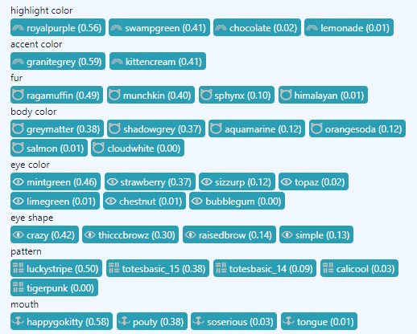

# Build Your Own CryptoKitties Breeding (Offspring) Calculator


Let's build a kitty breeding calculator
that shows all possible traits with the odds / probabilities.
Let's start with kitty #1001 and #1111 as parents a and b:

``` ruby
require 'copycats'

a = 0x00004a52931ce4085c14bdce014a0318846a0c808c60294a6314a34a1295b9ce  # kitty 1001
b = 0x000042d28390864842e7b9c900c6321086438c6098ca298c728867425cf6b1ac  # kitty 1111

agenes_kai = Base32.encode( a ).reverse # note: reverse string for easy array access
p agenes_kai
#=> "fffcaa9a466776661442979e55771661ffga2f225887aaaa"

bgenes_kai = Base32.encode( b ).reverse
p bgenes_kai
#=> "dedegfa984368776b77277f975554441affgf22a75589ac9"
```

Remember: For passing on the parents (a or b) gene
to become the baby's (new) primary gene the odds / probabilities are:
`0.375` (37.5%) for the primary (p) gene of parent (a or b),
`0.09375` (9.375%) for the hidden 1 (h1),
`0.0234375` (2.34375%) for the hidden 2 (h2), and
`0.0078125`(0.78125%) for the hidden 3 (h3).


Let's add up all the odds for the `body` (officially known as fur).
Let's start with parent a (that is, kitty #1001):

``` ruby
ODDS_BABY_TRAITS = {}
ODDS_BABY_TRAITS[:body] ||= Hash.new(0)

####
# step 1) add odds for parent a
trait = TRAITS[:body][:kai][agenes_kai[0]]
ODDS_BABY_TRAITS[:body][trait] += 0.375      # primary (p) - add ragamuffin (37.5%)
pp ODDS_BABY_TRAITS
#=> {:body=>{"ragamuffin"=>0.375}}

trait = TRAITS[:body][:kai][agenes_kai[1]]
ODDS_BABY_TRAITS[:body][trait] += 0.09375    # hidden 1 (h1) - add ragamuffin (9.375%)
pp ODDS_BABY_TRAITS
#=> {:body=>{"ragamuffin"=>0.46875}}

trait = TRAITS[:body][:kai][agenes_kai[2]]
ODDS_BABY_TRAITS[:body][trait] += 0.0234375  # hidden 2 (h2) - add ragamuffin (2.34375%)
pp ODDS_BABY_TRAITS
#=> {:body=>{"ragamuffin"=>0.4921875}}

trait = TRAITS[:body][:kai][agenes_kai[3]]
ODDS_BABY_TRAITS[:body][trait] += 0.0078125  # hidden 3 (h3) - add himalayan (0.78125%)
pp ODDS_BABY_TRAITS
#=> {:body=>{"ragamuffin"=>0.4921875, "himalayan"=>0.0078125}}
```

And let's add parent b (that is, kitty #1111):

``` ruby
####
# step 2) add odds for parent b
trait = TRAITS[:body][:kai][bgenes_kai[0]]
ODDS_BABY_TRAITS[:body][trait] += 0.375      # primary (p) - add munchkin (37.5%)
pp ODDS_BABY_TRAITS
#=> {:body=>{"ragamuffin"=>0.4921875, "himalayan"=>0.0078125, "munchkin"=>0.375}}

trait = TRAITS[:body][:kai][bgenes_kai[1]]
ODDS_BABY_TRAITS[:body][trait] += 0.09375    # hidden 1 (h1) - add sphynx (9.375%)
pp ODDS_BABY_TRAITS
#=> {:body=>{"ragamuffin"=>0.4921875, "himalayan"=>0.0078125, "munchkin"=>0.375, "sphynx"=>0.09375}}

trait = TRAITS[:body][:kai][bgenes_kai[2]]
ODDS_BABY_TRAITS[:body][trait] += 0.0234375  # hidden 2 (h2) - add munchkin (2.34375%)
pp ODDS_BABY_TRAITS
#=> {:body=>{"ragamuffin"=>0.4921875, "himalayan"=>0.0078125, "munchkin"=>0.3984375, "sphynx"=>0.09375}}

trait = TRAITS[:body][:kai][bgenes_kai[3]]
ODDS_BABY_TRAITS[:body][trait] += 0.0078125  # hidden 3 (h3) - add sphinx (0.78125%)
pp ODDS_BABY_TRAITS
#=> {:body=> {"ragamuffin"=>0.4921875, "himalayan"=>0.0078125, "munchkin"=>0.3984375, "sphynx"=>0.1015625}}
```

Voila! The odds for fur (`body`) traits for a new (offspring) baby read:
`{"ragamuffin"=>0.4921875, "himalayan"=>0.0078125, "munchkin"=>0.3984375, "sphynx"=>0.1015625}`.

Let's sort by highest odds / probability first:

``` ruby
ODDS_BABY_TRAITS[:body] = ODDS_BABY_TRAITS[:body].to_a.sort { |l,r| r[1] <=> l[1] }
pp ODDS_BABY_TRAITS
#=> {:body=> [["ragamuffin", 0.4921875], ["munchkin", 0.3984375], ["sphynx", 0.1015625], ["himalayan", 0.0078125]]}
```

Resulting in:

- ragamuffin => `0.4921875` (~49%)
- munchkin => `0.3984375` (~40%)
- sphynx => `0.1015625` (~10%)
- himalayan => `0.0078125` (~1%)

Compare with an online CryptoKitties (offspring)
breeding calculator service:


(Source: [`cattributes.org/#/1001/1111`](https://cattributes.org/#/1001/1111))

Bingo! The cattribute traits and odds / probabilities match up.


Now let's take on
all the other trait types, that is, pattern, eye color (`coloreyes`),
eye shape (`eyes`), base color (`color1`),
highlight color (`color2`), and so on
and let's code a `kittycalc` method
where you pass in the parents a and b
and get the odds.

``` ruby
def kittycalc( a, b )
  agenes_kai = Base32.encode( a ).reverse # note: reverse string for easy array access
  bgenes_kai = Base32.encode( b ).reverse

  odds = {}

  TRAITS.each_with_index do |(trait_key, trait_hash),i|
     odds[trait_key] ||= Hash.new(0)

     offset = i*4
     [agenes_kai, bgenes_kai].each do |genes_kai|
       p_kai  = genes_kai[0+offset]
       h1_kai = genes_kai[1+offset]
       h2_kai = genes_kai[2+offset]
       h3_kai = genes_kai[3+offset]

       ## kai to trait name mapping (e.g. '1' => 'savannah', etc.)
       kai = trait_hash[:kai]
       p  = kai[p_kai]
       h1 = kai[h1_kai]
       h2 = kai[h2_kai]
       h3 = kai[h3_kai]

       ## use code (e.g. PU00, PU01, etc.) if trait is unnamed
       code = trait_hash[:code]
       p  = "#{code}%02d" % Kai::NUMBER[p_kai]   if p.nil?
       h1 = "#{code}%02d" % Kai::NUMBER[h1_kai]  if h1.nil?
       h2 = "#{code}%02d" % Kai::NUMBER[h2_kai]  if h2.nil?
       h3 = "#{code}%02d" % Kai::NUMBER[h3_kai]  if h3.nil?

       odds[trait_key][p]  += 0.375      # add primary (p) odds
       odds[trait_key][h1] += 0.09375    # add hidden 1 (h1) odds
       odds[trait_key][h2] += 0.0234375  # add hidden 2 (h2) odds
       odds[trait_key][h3] += 0.0078125  # add hidden 3 (h3) odds
     end

     ## sort by highest odds / probabilities first
     odds[trait_key] = odds[trait_key].to_a.sort { |l,r| r[1] <=> l[1] }
  end
  odds
end
```

Let's try:

``` ruby
odds = kittycalc( a, b )
pp odds
```

resulting in:
``` ruby
{:body=>      
  [["ragamuffin", 0.4921875], ["munchkin", 0.3984375], ["sphynx", 0.1015625], ["himalayan", 0.0078125]],
 :pattern=>   
  [["luckystripe", 0.5], ["totesbasic", 0.46875], ["calicool", 0.03125]],
 :coloreyes=>
  [["mintgreen", 0.46875], ["strawberry", 0.375], ["sizzurp", 0.125], ["topaz", 0.0234375], ["chestnut", 0.0078125]],
 :eyes=>
  [["crazy", 0.4921875], ["thicccbrowz", 0.375], ["simple", 0.1328125]],
 :color1=>
  [["shadowgrey", 0.375], ["greymatter", 0.375], ["orangesoda", 0.1171875], ["aquamarine", 0.1171875], ["salmon", 0.015625]],
 :color2=>
  [["royalpurple", 0.5625], ["swampgreen", 0.40625], ["chocolate", 0.0234375], ["lemonade", 0.0078125]],
 :color3=>
  [["granitegrey", 0.59375], ["kittencream", 0.40625]],
 :wild=>
  [["WE03", 0.4921875], ["WE00", 0.390625], ["WE05", 0.1171875]],
 :mouth=>
  [["happygokitty", 0.5859375], ["pouty", 0.3828125], ["soserious", 0.03125]],
 :environment=>
  [["EN01", 0.5234375], ["EN14", 0.46875], ["EN09", 0.0078125]],
 :secret=>
  [["SE04", 0.4921875], ["SE06", 0.3828125], ["SE07", 0.125]],
 :prestige=>
  [["PU09", 0.59375], ["PU08", 0.3828125], ["PU11", 0.0234375]]}
```


Let's make the odds more readable with a `print_kittycalc_odds` helper:

``` ruby
def print_kittycalc_odds( odds )
  odds.each do |trait_key, recs|
    trait_hash = TRAITS[trait_key]

    puts "#{trait_hash[:name]} (#{trait_hash[:code]}):"
    recs.each do |rec|
      puts " #{'%5.2f'% (rec[1]*100)}% | #{rec[0]}"
    end
    puts
  end
end
```

Try `print_kittycalc_odds( odds )`. Resulting in:

```
Fur (FU):
 49.22% | ragamuffin
 39.84% | munchkin
 10.16% | sphynx
  0.78% | himalayan

Pattern (PA):
 50.00% | luckystripe
 46.88% | totesbasic
  3.12% | calicool

Eye Color (EC):
 46.88% | mintgreen
 37.50% | strawberry
 12.50% | sizzurp
  2.34% | topaz
  0.78% | chestnut

Eye Shape (ES):
 49.22% | crazy
 37.50% | thicccbrowz
 13.28% | simple

Base Color (BC):
 37.50% | shadowgrey
 37.50% | greymatter
 11.72% | orangesoda
 11.72% | aquamarine
  1.56% | salmon

Highlight Color (HC):
 56.25% | royalpurple
 40.62% | swampgreen
  2.34% | chocolate
  0.78% | lemonade

Accent Color (AC):
 59.38% | granitegrey
 40.62% | kittencream

Wild Element (WE):
 49.22% | WE03
 39.06% | WE00
 11.72% | WE05

Mouth (MO):
 58.59% | happygokitty
 38.28% | pouty
  3.12% | soserious

Environment (EN):
 52.34% | EN01
 46.88% | EN14
  0.78% | EN09

Secret Y Gene (SE):
 49.22% | SE04
 38.28% | SE06
 12.50% | SE07

Purrstige (PU):
 59.38% | PU09
 38.28% | PU08
  2.34% | PU11
```


## What about mewtations?

Good question. Let's add the missing odds / probabilities for new mewtations traits
to `kittycalc`. Remember: There's a 25% chance of getting a mutation for tier I & II
and a 12.5% chance for tier III & IIII
but only given A & B contain the right gene mutation pairs.


Remember: After swapping the genes in
the mixgenes formula
the odds / probabilities for the parents
genes ending up as primary are:
`0.75` (75%) for the primary (p) gene of parent (a or b),
`0.1875` (18.75%) for the hidden 1 (h1),
`0.046875` (4.6875%) for the hidden 2 (h2), and
`0.015625`(1.5625%) for the hidden 3 (h3).

With two parents and four genes (p, h1, h2, h3)
for every trait that results in 4 x 4 = 16 mewtation pairs:

```
(p', h1', h2', h3') x (p", h1", h2", h3")
                       =
(p', p"), (p', h1"), (p', h2"), (p', h3")
(h1',p"), (h1',h1"), (h1',h2"), (h1',h3")
(h2',p"), (h2',h1"), (h2',h2"), (h3',h3")
(h3',p"), (h3',h1"), (h3',h2"), (h3',h3")
```

Let's calculate the odds / probabilities for each pair:

``` ruby
p_p   = 0.75 * 0.75
p_h1  = 0.75 * 0.1875
p_h2  = 0.75 * 0.046875
p_h3  = 0.75 * 0.015625
total = p_p + p_h1 + p_h2 + p_h3
puts "p_p=#{p_p}, p_h1=#{p_h1}, p_h2=#{p_h2}, p_h3=#{p_h3}, total=#{total}"
#=> p_p=0.5625, p_h1=0.140625, p_h2=0.03515625, p_h3=0.01171875, total=0.75

h1_p  = 0.1875 * 0.75
h1_h1 = 0.1875 * 0.1875
h1_h2 = 0.1875 * 0.046875
h1_h3 = 0.1875 * 0.015625
total = h1_p + h1_h1 + h1_h2 + h1_h3
puts "h1_p=#{h1_p}, h1_h1=#{h1_h1}, h1_h2=#{h1_h2}, h1_h3=#{h1_h3}, total=#{total}"
#=> h1_p=0.140625, h1_h1=0.03515625, h1_h2=0.0087890625, h1_h3=0.0029296875, total=0.1875

h2_p  = 0.046875 * 0.75
h2_h1 = 0.046875 * 0.1875
h2_h2 = 0.046875 * 0.046875
h2_h3 = 0.046875 * 0.015625
total = h2_p + h2_h1 + h2_h2 + h2_h3
puts "h2_p=#{h2_p}, h2_h1=#{h2_h1}, h2_h2=#{h2_h2}, h2_h3=#{h2_h3}, total=#{total}"
#=> h2_p=0.03515625, h2_h1=0.0087890625, h2_h2=0.002197265625, h2_h3=0.000732421875, total=0.046875

h3_p  = 0.015625 * 0.75
h3_h1 = 0.015625 * 0.1875
h3_h2 = 0.015625 * 0.046875
h3_h3 = 0.015625 * 0.015625
total = h3_p + h3_h1 + h3_h2 + h3_h3
puts "h3_p=#{h3_p}, h3_h1=#{h3_h1}, h3_h2=#{h3_h2}, h3_h3=#{h3_h3}, total=#{total}"
#=> h3_p=0.01171875, h3_h1=0.0029296875, h3_h2=0.000732421875, h3_h3=0.000244140625, total=0.015625


total = p_p  + p_h1  + p_h2  + p_h3  +
        h1_p + h1_h1 + h1_h2 + h1_h3 +
        h2_p + h2_h1 + h2_h2 + h2_h3 +
        h3_p + h3_h1 + h3_h2 + h3_h3
puts "total=#{total}"
#=> total=1.0
```

Note: All sixteen pairs totals sums up to 1.0, that is, 100%.
Or with predefined odds in `p`, `h1`, `h2`, `h3`:

``` ruby
p  = 0.75
h1 = 0.1875
h2 = 0.046875
h3 = 0.015625

p_p   = p * p
p_h1  = p * h1
p_h2  = p * h2
p_h3  = p * h3
puts "p_p=#{p_p}, p_h1=#{p_h1}, p_h2=#{p_h2}, p_h3=#{p_h3}"
#=> p_p=0.5625, p_h1=0.140625, p_h2=0.03515625, p_h3=0.01171875

h1_p  = h1 * p
h1_h1 = h1 * h1
h1_h2 = h1 * h2
h1_h3 = h1 * h3
puts "h1_p=#{h1_p}, h1_h1=#{h1_h1}, h1_h2=#{h1_h2}, h1_h3=#{h1_h3}"
#=> h1_p=0.140625, h1_h1=0.03515625, h1_h2=0.0087890625, h1_h3=0.0029296875

h2_p  = h2 * p
h2_h1 = h2 * h1
h2_h2 = h2 * h2
h2_h3 = h2 * h3
puts "h2_p=#{h2_p}, h2_h1=#{h2_h1}, h2_h2=#{h2_h2}, h2_h3=#{h2_h3}"
#=> h2_p=0.03515625, h2_h1=0.0087890625, h2_h2=0.002197265625, h2_h3=0.000732421875

h3_p  = h3 * p
h3_h1 = h3 * h1
h3_h2 = h3 * h2
h3_h3 = h3 * h3
puts "h3_p=#{h3_p}, h3_h1=#{h3_h1}, h3_h2=#{h3_h2}, h3_h3=#{h3_h3}"
#=> h3_p=0.01171875, h3_h1=0.0029296875, h3_h2=0.000732421875, h3_h3=0.000244140625

total = p_p  + p_h1  + p_h2  + p_h3  +
        h1_p + h1_h1 + h1_h2 + h1_h3 +
        h2_p + h2_h1 + h2_h2 + h2_h3 +
        h3_p + h3_h1 + h3_h2 + h3_h3
puts "total=#{total}"
#=> total=1.0
```

So what? In english that tells us if the primary gene (`p'`)
of parent a
and the primary gene (`p"`) of parent b are a mewtation pair
than the odds / probabilities are:

``` ruby
puts p_p_i = 0.75 * 0.75 * 0.25      # i) mutation (25%)
#=> 0.140625
puts p_p_ii = 0.75 * 0.75 * 0.75     # ii) no mutation (75%)
#=> 0.421875
puts p_p_i + p_p_ii
#=> 0.5625
```

That's the "famous" 14% (`0.140625`) of mutation probability - written down in many mutation articles -
for mutation level I & II (25%) if `p'` and `p"` hold the right gene pair.
Let's try another pair with `p'` and `h1"`:

``` ruby
puts p_h1_i = 0.75 * 0.1875 * 0.25   # i) mutation (25%)
#=> 0.03515625
puts p_h1_ii = 0.75 * 0.1875 * 0.75  # ii) no mutation (75%)
#=> 0.10546875
puts p_h1_i + p_h1_ii
#=> 0.140625
```

Resulting in a mutation probability of 3.5% (`0.03515625`)
for mutation level I & II (25%).

Let's code a new `kittycalc_mewtations( a, b )` method
that checks all traits for mewtation pairs and returns the odds / probabilites:

``` ruby
def kittycalc_mewtations( a, b )
  agenes_kai = Base32.encode( a ).reverse # note: reverse string for easy array access
  bgenes_kai = Base32.encode( b ).reverse

  odds = {}

  #########
  #  4x4 = 16 gene pairs
  #   0 = primary (p)     - 0.75
  #   1 = hidden 1 (h1)   - 0.1875
  #   2 = hidden 2 (h2)   - 0.046875
  #   3 = hidden 3 (h3)   - 0.015625
  pairs = [[0,0],[0,1],[0,2],[0,3],
           [1,0],[1,1],[1,2],[1,3],
           [2,0],[2,1],[2,2],[2,3],
           [3,0],[3,1],[3,2],[3,3]]
  odds_genes = [0.75, 0.1875, 0.046875, 0.015625]

  TRAITS.each_with_index do |(trait_key, trait_hash),i|
    odds[trait_key] ||= []

    offset = i*4
    pairs.each do |pair|
      a_kai = agenes_kai[pair[0]+offset]
      b_kai = bgenes_kai[pair[1]+offset]

      gene1 = Kai::NUMBER[a_kai]  ## convert kai to integer number
      gene2 = Kai::NUMBER[b_kai]

      ## note: mutation code copied from mixgenes formula
      if gene1 > gene2
        gene1, gene2 = gene2, gene1
      end
      if (gene2 - gene1) == 1 && gene1.even?  ## bingo! mewtation pair
        probability = 0.25
        if gene1 > 23
          probability /= 2
        end
        mutation  = (gene1 / 2) + 16

        odds_pair = odds_genes[pair[0]] * odds_genes[pair[1]] * probability

        odds[trait_key] << [pair,
                            [Kai::ALPHABET[gene1], Kai::ALPHABET[gene2]],
                            Kai::ALPHABET[mutation],
                            odds_pair]
      end
    end
    odds[trait_key] = odds[trait_key].sort { |l,r| r[3] <=> l[3] }
  end
  odds
end
```

Let's try the kitty #1001 and #1111:

``` ruby
a = 0x00004a52931ce4085c14bdce014a0318846a0c808c60294a6314a34a1295b9ce  # kitty 1001
b = 0x000042d28390864842e7b9c900c6321086438c6098ca298c728867425cf6b1ac  # kitty 1111

odds = kittycalc_mewtations( a, b )
pp odds
```

resulting in:

``` ruby
{:body=>[],
 :pattern=>
  [[[0, 3], ["9", "a"], "m", 0.0029296875],
   [[1, 3], ["9", "a"], "m", 0.000732421875],
   [[2, 2], ["9", "a"], "m", 0.00054931640625],
   [[3, 3], ["9", "a"], "m", 6.103515625e-05]],
 :coloreyes=>
  [[[0, 2], ["3", "4"], "i", 0.0087890625],
   [[3, 0], ["7", "8"], "k", 0.0029296875]],
 :eyes=>
  [[[0, 0], ["7", "8"], "k", 0.140625]],
 :color1=>
  [[[0, 3], ["1", "2"], "h", 0.0029296875]],
 :color2=>[],
 :color3=>[],
 :wild=>[],
 :mouth=>
  [[[0, 3], ["f", "g"], "p", 0.0029296875],
   [[2, 1], ["f", "g"], "p", 0.002197265625],
   [[1, 3], ["f", "g"], "p", 0.000732421875],
   [[2, 2], ["f", "g"], "p", 0.00054931640625]],
 :environment=>[],
 :secret=>
  [[[1, 0], ["7", "8"], "k", 0.03515625],
   [[2, 0], ["7", "8"], "k", 0.0087890625],
   [[3, 3], ["7", "8"], "k", 6.103515625e-05]],
 :prestige=>
  [[[0, 0], ["9", "a"], "m", 0.140625],
   [[1, 0], ["9", "a"], "m", 0.03515625],
   [[2, 0], ["9", "a"], "m", 0.0087890625],
   [[3, 0], ["9", "a"], "m", 0.0029296875],
   [[0, 3], ["9", "a"], "m", 0.0029296875],
   [[1, 3], ["9", "a"], "m", 0.000732421875],
   [[2, 3], ["9", "a"], "m", 0.00018310546875],
   [[3, 3], ["9", "a"], "m", 6.103515625e-05]]}
```

Let's use a `print_kittycalc_mewtations_odds` helper for
making the mewtation pairs and odds more readable:

``` ruby
def print_kittycalc_mewtations_odds( odds )
  gene_names = ['p','h1','h2','h3']

  odds.each do |trait_key, recs|
    trait_hash = TRAITS[trait_key]

    next if recs.empty?   ## skip trait types with no mewtations

    puts "#{trait_hash[:name]} (#{trait_hash[:code]}) - #{recs.size} Mewtation Pair(s):"
    recs.each do |rec|
      a_kai = rec[1][0]
      b_kai = rec[1][1]
      m_kai = rec[2]

      a = trait_hash[:kai][a_kai]
      b = trait_hash[:kai][b_kai]
      m = trait_hash[:kai][m_kai]

      ## use code (e.g. PU00, PU01, etc.) if trait is unnamed
      code = trait_hash[:code]
      a = "#{code}%02d" % Kai::NUMBER[a_kai]  if a.nil?
      b = "#{code}%02d" % Kai::NUMBER[b_kai]  if b.nil?
      m = "#{code}%02d" % Kai::NUMBER[m_kai]  if m.nil?

      print " #{'%5.2f'% (rec[3]*100)}% | "
      print "%-18s" % "#{m}"
      print " | "
      print "%-5s" % "#{gene_names[rec[0][0]]}+#{gene_names[rec[0][1]]}"
      print " | "
      print "#{a}+#{b}"
      print "\n"
    end
    puts
  end
end
```

Try `print_kittycalc_mewtations_odds( odds )`. Resulting in:

```
Pattern (PA) - 4 Mewtation Pair(s):
  0.29% | tigerpunk          | p+h3  | calicool+luckystripe
  0.07% | tigerpunk          | h1+h3 | calicool+luckystripe
  0.05% | tigerpunk          | h2+h2 | calicool+luckystripe
  0.01% | tigerpunk          | h3+h3 | calicool+luckystripe

Eye Color (EC) - 2 Mewtation Pair(s):
  0.88% | limegreen          | p+h2  | topaz+mintgreen
  0.29% | bubblegum          | h3+p  | chestnut+strawberry

Eye Shape (ES) - 1 Mewtation Pair(s):
 14.06% | raisedbrow         | p+p   | crazy+thicccbrowz

Base Color (BC) - 1 Mewtation Pair(s):
  0.29% | cloudwhite         | p+h3  | shadowgrey+salmon

Mouth (MO) - 4 Mewtation Pair(s):
  0.29% | tongue             | p+h3  | happygokitty+soserious
  0.22% | tongue             | h2+h1 | happygokitty+soserious
  0.07% | tongue             | h1+h3 | happygokitty+soserious
  0.05% | tongue             | h2+h2 | happygokitty+soserious
```

Add-up and compare the mutation probabilities with
an online CryptoKitties (offspring) breeding calculator service:

- Pattern:    tigerpunk (0.4%)
- Eye Color:  limegreen (0.9%), bubblegum (0.3%)
- Eye Shape:  raisedbrow (14%)
- Base Color: cloudwhite (0.3%)
- Mouth:      tongue (0.6%)

(Source: [`kittycalc.co/?k1=1001&k2=1111`](https://kittycalc.co/?k1=1001&k2=1111))

Bingo! The mewtations cattribute traits and odds / probabilities match up.


All together now. Let's add up the odds from step one and the mewtations
in a new all-in-one `kittycalc` version 2.0:


``` ruby
def kittycalc( a, b )
  agenes = Base32.encode( a ).reverse # note: reverse string for easy array access
  bgenes = Base32.encode( b ).reverse

  odds            = kittycalc_step1( agenes, bgenes )
  odds_mewtations = kittycalc_mewtations( agenes, bgenes )

  ## update odds with mewtations
  odds_mewtations.each do |trait_key, recs|
    next if recs.empty?   ## skip trait types with no mewtations

    recs.each do |rec|
      agene          = rec[1][0]
      bgene          = rec[1][1]
      mewtation      = rec[2]
      odds_mewtation = rec[3]

      odds[trait_key][mewtation] += odds_mewtation
      odds[trait_key][agene]     -= odds_mewtation / 2.0
      odds[trait_key][bgene]     -= odds_mewtation / 2.0
    end
  end

  odds.each do |trait_key, hash|
    recs = odds[trait_key].to_a
    recs = recs.map do |rec|
       ## map kai char e.g '1' to trait name e.g. savannah'
       name = TRAITS[trait_key][:kai][rec[0]]
       ## note: use code (e.g. PU00, PU01, etc.) if trait is unnamed
       name = TRAITS[trait_key][:code] + Kai::CODE[rec[0]]  if name.nil?
       [name,rec[1]]
    end
    ## sort by highest odds / probabilities first
    recs = recs.sort { |l,r| r[1] <=> l[1] }
    odds[trait_key] = recs
  end

  odds
end
```

Note: If you add the odds for the new mewtation trait
e.g. `odds[trait_key][mewtation] += odds_mewtation`
you also need to subtract the odds for the two traits
making up the mewtation pair
e.g. `odds[trait_key][agene] -= odds_mewtation / 2.0` and
`odds[trait_key][bgene] -= odds_mewtation / 2.0`
to keep the balance of 100% (`1.0`).
Let's add the missing `kittycalc_step1` and `kittycalc_mewtations` code:


``` ruby
def kittycalc_step1( agenes, bgenes )
  odds = {}

  TRAITS.each_with_index do |(trait_key, trait_hash),i|
     odds[trait_key] ||= Hash.new(0)

     offset = i*4
     [agenes, bgenes].each do |genes|
       p  = genes[0+offset]
       h1 = genes[1+offset]
       h2 = genes[2+offset]
       h3 = genes[3+offset]

       odds[trait_key][p]  += 0.375      # add primary (p) odds
       odds[trait_key][h1] += 0.09375    # add hidden 1 (h1) odds
       odds[trait_key][h2] += 0.0234375  # add hidden 2 (h2) odds
       odds[trait_key][h3] += 0.0078125  # add hidden 3 (h3) odds
     end
  end
  odds
end


def kittycalc_mewtations( agenes, bgenes )
  odds = {}

  #########
  #  4x4 = 16 gene pairs
  #   0 = primary (p)     - 0.75
  #   1 = hidden 1 (h1)   - 0.1875
  #   2 = hidden 2 (h2)   - 0.046875
  #   3 = hidden 3 (h3)   - 0.015625
  pairs = [[0,0],[0,1],[0,2],[0,3],
           [1,0],[1,1],[1,2],[1,3],
           [2,0],[2,1],[2,2],[2,3],
           [3,0],[3,1],[3,2],[3,3]]
  odds_genes = [0.75, 0.1875, 0.046875, 0.015625]

  TRAITS.each_with_index do |(trait_key, trait_hash),i|
    odds[trait_key] ||= []

    offset = i*4
    pairs.each do |pair|
      gene1 = Kai::NUMBER[ agenes[pair[0]+offset] ]  ## convert kai to integer number
      gene2 = Kai::NUMBER[ bgenes[pair[1]+offset] ]

      ## note: mutation code copied from mixgenes formula
      if gene1 > gene2
        gene1, gene2 = gene2, gene1
      end
      if (gene2 - gene1) == 1 && gene1.even?  ## bingo! mewtation pair
        probability = 0.25
        if gene1 > 23
          probability /= 2
        end
        mutation  = (gene1 / 2) + 16

        odds_pair = odds_genes[pair[0]] * odds_genes[pair[1]] * probability

        odds[trait_key] << [pair,
                            [Kai::ALPHABET[gene1], Kai::ALPHABET[gene2]],
                            Kai::ALPHABET[mutation],
                            odds_pair]
      end
    end
    ## sort by highest odds / probabilities first
    odds[trait_key] = odds[trait_key].sort { |l,r| r[3] <=> l[3] }
  end
  odds
end
```

Ready to go. Stand back two hundred meter and let's try:

``` ruby
odds = kittycalc( a, b )
pp odds
```

resulting in:

``` ruby
{:body=>
  [["ragamuffin", 0.4921875],
   ["munchkin", 0.3984375],
   ["sphynx", 0.1015625],
   ["himalayan", 0.0078125]],
 :pattern=>
  [["luckystripe", 0.49786376953125],
   ["totesbasic", 0.375],
   ["totesbasic", 0.09375],
   ["calicool", 0.02911376953125],
   ["tigerpunk", 0.0042724609375]],
 :coloreyes=>
  [["mintgreen", 0.46435546875],
   ["strawberry", 0.37353515625],
   ["sizzurp", 0.125],
   ["topaz", 0.01904296875],
   ["limegreen", 0.0087890625],
   ["chestnut", 0.00634765625],
   ["bubblegum", 0.0029296875]],
 :eyes=>
  [["crazy", 0.421875],
   ["thicccbrowz", 0.3046875],
   ["raisedbrow", 0.140625],
   ["simple", 0.1328125]],
 :color1=>
  [["greymatter", 0.375],
   ["shadowgrey", 0.37353515625],
   ["aquamarine", 0.1171875],
   ["orangesoda", 0.1171875],
   ["salmon", 0.01416015625],
   ["cloudwhite", 0.0029296875]],
 :color2=>
  [["royalpurple", 0.5625],
   ["swampgreen", 0.40625],
   ["chocolate", 0.0234375],
   ["lemonade", 0.0078125]],
 :color3=>
  [["granitegrey", 0.59375],
   ["kittencream", 0.40625]],
 :mouth=>
  [["happygokitty", 0.582733154296875],
   ["pouty", 0.3828125],
   ["soserious", 0.028045654296875],
   ["tongue", 0.00640869140625]]}
```

Note: The "real" output if you follow along coding on
your very own computer includes the "unnamed" traits
`wild`, `environment`, `secrect` and `prestige` too.

``` ruby
{:wild=>
  [["WE03", 0.4921875],
   ["WE00", 0.390625],
   ["WE05", 0.1171875]],
 :environment=>
  [["EN01", 0.5234375],
   ["EN14", 0.46875],
   ["EN09", 0.0078125]],
 :secret=>
  [["SE04", 0.4921875],
   ["SE06", 0.360809326171875],
   ["SE07", 0.102996826171875],
   ["SE19", 0.04400634765625]],
 :prestige=>
  [["PU09", 0.498046875],
   ["PU08", 0.287109375],
   ["PU20", 0.19140625],
   ["PU11", 0.0234375]]}
```

Let's keep it shorter and snip out the "unnamed" traits.
Let's reuse the `print_kittycalc_odds` helper
to make the odds more readable.
Try `print_kittycalc_odds( odds )`. Resulting in:

```
Fur (FU):
 49.22% | ragamuffin
 39.84% | munchkin
 10.16% | sphynx
  0.78% | himalayan

Pattern (PA):
 49.79% | luckystripe
 37.50% | totesbasic
  9.38% | totesbasic
  2.91% | calicool
  0.43% | tigerpunk

Eye Color (EC):
 46.44% | mintgreen
 37.35% | strawberry
 12.50% | sizzurp
  1.90% | topaz
  0.88% | limegreen
  0.63% | chestnut
  0.29% | bubblegum

Eye Shape (ES):
 42.19% | crazy
 30.47% | thicccbrowz
 14.06% | raisedbrow
 13.28% | simple

Base Color (BC):
 37.50% | greymatter
 37.35% | shadowgrey
 11.72% | aquamarine
 11.72% | orangesoda
  1.42% | salmon
  0.29% | cloudwhite

Highlight Color (HC):
 56.25% | royalpurple
 40.62% | swampgreen
  2.34% | chocolate
  0.78% | lemonade

Accent Color (AC):
 59.38% | granitegrey
 40.62% | kittencream

Mouth (MO):
 58.27% | happygokitty
 38.28% | pouty
  2.80% | soserious
  0.64% | tongue
```

Now if you compare the new numbers
with a CryptoKitties (offspring) breeding calculator service - than the numbers match up. Bingo!




To double check let's sum up all odds for the cattribute traits
to see if the match up to 100% (`1.0`) each.

``` ruby
def check_odds( odds )
  odds.each do |trait_key,recs|
    total = recs.reduce(0) {|sum,rec| sum+=rec[1]; sum}
    puts "#{trait_key}: #{total}"
  end
end

check_odds( odds )
```

Resulting in:

```
body: 1.0
pattern: 1.0
coloreyes: 1.0
eyes: 1.0
color1: 1.0
color2: 1.0
color3: 1.0
wild: 1.0
mouth: 1.0
environment: 1.0
secret: 1.0
prestige: 1.0
```
