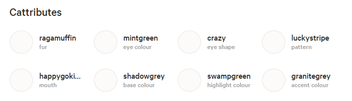
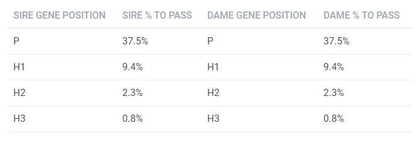
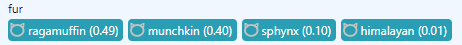

# Programming Crypto Collectibles Step-by-Step Book / Guide

_Let's start with CryptoKitties & Copycats. Inside Unique Bits & Bytes on the Blockchain..._


At the heart of crypto collectibles on the blockchain are unique bits & bytes.
For CryptoKitties this is a 240-bit integer that holds the
super "sekretoooo" genome / genes.


Let's use Kitty #1001 as an example
and look at the "magic" 240-bit integer number:

``` ruby
# A 240-bit super "sekretoooo" integer genome

# hexadecimal (base 16)
genome = 0x00004a52931ce4085c14bdce014a0318846a0c808c60294a6314a34a1295b9ce
# decimal (base 10)
genome = 512955438081049600613224346938352058409509756310147795204209859701881294
# binary (base 2)
genome = 0b010010100101001010010011000111001110010000001000010111000001010010111101110011100000000101001010000000110001100010000100\
           011010100000110010000000100011000110000000101001010010100110001100010100101000110100101000010010100101011011100111001110
```


Let's convert from decimal (base 10) to hexadecimal (base 16 - 2^4)
and binary (base 2 that is, 0 and 1):

``` ruby
p genome    # printed as decimal (base 10) by default
#=> 512955438081049600613224346938352058409509756310147795204209859701881294

p genome.to_s(16)
#=> "4a52931ce4085c14bdce014a0318846a0c808c60294a6314a34a1295b9ce"

p genome.to_s(2)
#=> "10010100101001010010011000111001110010000001000010111000001010010111101110011100000000101001010000000110001100010000100\
#     011010100000110010000000100011000110000000101001010010100110001100010100101000110100101000010010100101011011100111001110"
```

So what? Thanks to Kai Turner
who first deciphered the CryptoKitties 240-bit genome
in  [The CryptoKitties Genome Project: On Dominance, Inheritance and Mutation](https://medium.com/@kaigani/the-cryptokitties-genome-project-on-dominance-inheritance-and-mutation-b73059dcd0a4) on January 2018
we  know today
that the genome breaks down into 5-bit chunks.
And every 5-bit chunk is a gene.
And four 5-bit chunks (known as the primary, hidden 1, hidden 2 and hidden 3 gene)
get grouped into a trait
(e.g. fur, pattern, eye color, eye shape, base color, highlight color, and so on)
resulting in 12 trait groups of 4 (x 5-bit) genes
(that is, 12 x 4 x 5-bit = 240 bits).


Let's break the genome into 5-bit chunks
using `Base32.encode` from the [base32-alphabets library](https://github.com/cryptocopycats/base32-alphabets).

``` ruby
require 'base32-alphabets'

Base32.format = :electrologica   # use the Electrologica Alphabet / Variant


# hexadecimal (base 16)
genome = 0x00004a52931ce4085c14bdce014a0318846a0c808c60294a6314a34a1295b9ce  # kitty 1001

p Base32.encode( genome )
#=> "09-09-09-09-06-07-07-04-01-01-14-01-09-15-14-14-00-05-05-00-06-06-04-04-13-08-06-08-01-03-03-00-05-05-05-06-06-05-05-03-09-08-09-09-11-14-14-14"
```

Bingo!
Using a genes / traits chart you can now decipher the genome.


---

CryptoKitties Genes / Traits Chart

Fur (0-3) • Pattern (4-7) • Eye Color (8-11) • Eye Shape (12-15) • Base Color (16-19) • Highlight Color (20-23) • Accent Color (24-27) • Wild (28-31) • Mouth (32-35) • Environment (36-39) • Secret Y Gene (40-43) • Purrstige (44-47)

Fur (FU) - Genes 0-3:

|Kai|Code|Cattribute   |Kai|Code|Cattribute  |
|--:|---:|-------------|--:|---:|------------|
| 1 | FU00 | **[savannah](https://www.cryptokitties.co/search?include=sale,sire,other&search=savannah)**  | h | FU16 | **[norwegianforest](https://www.cryptokitties.co/search?include=sale,sire,other&search=norwegianforest)** I |
| 2 | FU01 | **[selkirk](https://www.cryptokitties.co/search?include=sale,sire,other&search=selkirk)**  | i | FU17 | **[mekong](https://www.cryptokitties.co/search?include=sale,sire,other&search=mekong)** I |
| 3 | FU02 | **[chantilly](https://www.cryptokitties.co/search?include=sale,sire,other&search=chantilly)**  | j | FU18 | **[highlander](https://www.cryptokitties.co/search?include=sale,sire,other&search=highlander)** I |
| 4 | FU03 | **[birman](https://www.cryptokitties.co/search?include=sale,sire,other&search=birman)**  | k | FU19 | **[balinese](https://www.cryptokitties.co/search?include=sale,sire,other&search=balinese)** I |
| 5 | FU04 | **[koladiviya](https://www.cryptokitties.co/search?include=sale,sire,other&search=koladiviya)**  | m | FU20 | **[lynx](https://www.cryptokitties.co/search?include=sale,sire,other&search=lynx)** I |
| 6 | FU05 | **[bobtail](https://www.cryptokitties.co/search?include=sale,sire,other&search=bobtail)**  | n | FU21 | **[mainecoon](https://www.cryptokitties.co/search?include=sale,sire,other&search=mainecoon)** I |
| 7 | FU06 | **[manul](https://www.cryptokitties.co/search?include=sale,sire,other&search=manul)**  | o | FU22 | **[laperm](https://www.cryptokitties.co/search?include=sale,sire,other&search=laperm)** I |
| 8 | FU07 | **[pixiebob](https://www.cryptokitties.co/search?include=sale,sire,other&search=pixiebob)**  | p | FU23 | **[persian](https://www.cryptokitties.co/search?include=sale,sire,other&search=persian)** I |
| 9 | FU08 | **[siberian](https://www.cryptokitties.co/search?include=sale,sire,other&search=siberian)**  | q | FU24 | **[fox](https://www.cryptokitties.co/search?include=sale,sire,other&search=fox)** II |
| a | FU09 | **[cymric](https://www.cryptokitties.co/search?include=sale,sire,other&search=cymric)**  | r | FU25 | **[kurilian](https://www.cryptokitties.co/search?include=sale,sire,other&search=kurilian)** II |
| b | FU10 | **[chartreux](https://www.cryptokitties.co/search?include=sale,sire,other&search=chartreux)**  | s | FU26 | **[toyger](https://www.cryptokitties.co/search?include=sale,sire,other&search=toyger)** II |
| c | FU11 | **[himalayan](https://www.cryptokitties.co/search?include=sale,sire,other&search=himalayan)**  | t | FU27 | **[manx](https://www.cryptokitties.co/search?include=sale,sire,other&search=manx)** II |
| d | FU12 | **[munchkin](https://www.cryptokitties.co/search?include=sale,sire,other&search=munchkin)**  | u | FU28 | **[lykoi](https://www.cryptokitties.co/search?include=sale,sire,other&search=lykoi)** III |
| e | FU13 | **[sphynx](https://www.cryptokitties.co/search?include=sale,sire,other&search=sphynx)**  | v | FU29 | **[burmilla](https://www.cryptokitties.co/search?include=sale,sire,other&search=burmilla)** III |
| f | FU14 | **[ragamuffin](https://www.cryptokitties.co/search?include=sale,sire,other&search=ragamuffin)**  | w | FU30 | **[liger](https://www.cryptokitties.co/search?include=sale,sire,other&search=liger)** IIII |
| g | FU15 | **[ragdoll](https://www.cryptokitties.co/search?include=sale,sire,other&search=ragdoll)**  | x | FU31 | ? |

...

(Source: [copycats/GENES.md](https://github.com/cryptocopycats/copycats/blob/master/GENES.md))

---


Let's start deciphering from right-to-left `...06-05-05-03-09-08-09-09-11-14-14-14`, that is,
`14` maps to ragamuffin, `14` to ragamuffin, `14` to ragamuffin, `11` to himalayan, and so on:


Fur (FU) - Genes 0-3:

|5-Bit Chunk| Gene | Trait      |          |
|----------:|-----:|------------|----------|
| 14        | 0    | ragamuffin | Primary  |
| 14        | 1    | ragamuffin | Hidden 1 |
| 14        | 2    | ragamuffin | Hidden 2 |
| 11        | 3    | himalayan  | Hidden 3 |

Pattern (PA) - Genes 4-7:

|5-Bit Chunk| Gene | Trait       |          |
|----------:|-----:|-------------|----------|
| 09        | 4    | luckystripe | Primary  |
| 09        | 5    | luckystripe | Hidden 1 |
| 08        | 6    | calicool     | Hidden 2 |
| 09        | 7    | luckystripe  | Hidden 3 |

Eye Color (EC) - Genes 8-11:

|5-Bit Chunk| Gene | Trait       |          |
|----------:|-----:|-------------|----------|
| 03        | 8    | mintgreen   | Primary  |
| 05        | 9    | sizzurp     | Hidden 1 |
| 05        | 10   | sizzurp     | Hidden 2 |
| 06        | 11   | chestnut    | Hidden 3 |


and so on. Let's try another kitty #1111:

``` ruby
genome = 0x000042d28390864842e7b9c900c6321086438c6098ca298c728867425cf6b1ac # kitty 1111

p Base32.encode( genome )
#=> "08-11-09-08-07-04-04-06-09-01-01-14-15-14-14-09-00-03-03-03-04-04-04-06-08-14-06-06-01-06-06-10-05-06-06-07-05-02-03-07-08-09-14-15-13-12-13-12"
```

Again using a genes / traits chart you can now decipher the genome.
Let's start from right-to-left `...05-02-03-07-08-09-14-15-13-12-13-12`, that is,
`12` maps to munchkin, `13` to sphynx, and so on:

Fur (FU) - Genes 0-3:

|5-Bit Chunk| Gene | Trait      |          |
|----------:|-----:|------------|----------|
| 12        | 0    | munchkin   | Primary  |
| 13        | 1    | sphynx     | Hidden 1 |
| 12        | 2    | munchkin   | Hidden 2 |
| 13        | 3    | sphynx     | Hidden 3 |

Pattern (PA) - Genes 4-7:

|5-Bit Chunk| Gene | Trait       |          |
|----------:|-----:|-------------|----------|
| 15        | 4    | totesbasic  | Primary  |
| 14        | 5    | totesbasic  | Hidden 1 |
| 09        | 6    | luckystripe | Hidden 2 |
| 08        | 7    | calicool    | Hidden 3 |

Eye Color (EC) - Genes 8-11:

|5-Bit Chunk| Gene | Trait       |          |
|----------:|-----:|-------------|----------|
| 07        | 8    | strawberry  | Primary  |
| 03        | 9    | mintgreen   | Hidden 1 |
| 02        | 10   | topaz       | Hidden 2 |
| 05        | 11   | isotope     | Hidden 3 |

and so on.

What's Base32?

Encoding / decoding numbers in 5-bit chunks is called base 32
because 2^5 (=2 * 2 * 2 * 2 * 2) results in 32 values.
Using the Electrologica notation / alphabet
(`00 01 02 03 04 05 06 07 08 09 10 11 12 13 14 15 16 17 18 19 20 21 22 23 24 25 26 27 28 29 30 31`) the conversion chart reads:


|Base32 |Binary |Num|Base32 |Binary |Num|Base32 |Binary |Num|Base32 |Binary |Num|
|------:|------:|--:|------:|------:|--:|------:|------:|--:|------:|------:|--:|
| **00** | 00000 | 0 | **08** | 01000 | 8 | **16** | 10000 |16 | **24** | 11000 |24 |
| **01** | 00001 | 1 | **09** | 01001 | 9 | **17** | 10001 |17 | **25** | 11001 |25 |
| **02** | 00010 | 2 | **10** | 01010 | 10 | **18** | 10010 |18 | **26** | 11010 |26 |
| **03** | 00011 | 3 | **11** | 01011 | 11 | **19** | 10011 |19 | **27** | 11011 |27 |
| **04** | 00100 | 4 | **12** | 01100 | 12 | **20** | 10100 |20 | **28** | 11100 |28 |
| **05** | 00101 | 5 | **13** | 01101 | 13 | **21** | 10101 |21 | **29** | 11101 |29 |
| **06** | 00110 | 6 | **14** | 01110 | 14 | **22** | 10110 |22 | **30** | 11110 |30 |
| **07** | 00111 | 7 | **15** | 01111 | 15 | **23** | 10111 |23 | **31** | 11111 |31 |


What about Kai notation / alphabet?

The Kai (Base 32) notation / alphabet is named in honor of Kai Turner
who first deciphered the CryptoKitties 240-bit genome
in 5-bit chunks.
The Kai notation / alphabet
follows base56
and uses (`123456789abcdefghijkmnopqrstuvwx`).
The conversion chart reads:

|Kai    |Binary |Num|Kai    |Binary |Num|Kai    |Binary |Num|Kai    |Binary |Num|
|------:|------:|--:|------:|------:|--:|------:|------:|--:|------:|------:|--:|
| **1** | 00000 | 0 | **9** | 01000 | 8 | **h** | 10000 |16 | **q** | 11000 |24 |
| **2** | 00001 | 1 | **a** | 01001 | 9 | **i** | 10001 |17 | **r** | 11001 |25 |
| **3** | 00010 | 2 | **b** | 01010 | 10 | **j** | 10010 |18 | **s** | 11010 |26 |
| **4** | 00011 | 3 | **c** | 01011 | 11 | **k** | 10011 |19 | **t** | 11011 |27 |
| **5** | 00100 | 4 | **d** | 01100 | 12 | **m** | 10100 |20 | **u** | 11100 |28 |
| **6** | 00101 | 5 | **e** | 01101 | 13 | **n** | 10101 |21 | **v** | 11101 |29 |
| **7** | 00110 | 6 | **f** | 01110 | 14 | **o** | 10110 |22 | **w** | 11110 |30 |
| **8** | 00111 | 7 | **g** | 01111 | 15 | **p** | 10111 |23 | **x** | 11111 |31 |

Note:  - the digit-0 and the letter-l
are NOT used in the kai alphabet / notation.


Let's convert the example kitty genomes to
Kai notation:

``` ruby
require 'base32-alphabets'

Base32.format = :kai   # use the Kai Alphabet / Variant


# hexadecimal (base 16)
genome = 0x00004a52931ce4085c14bdce014a0318846a0c808c60294a6314a34a1295b9ce  # kitty 1001

p Base32.encode( genome )
#=> "aaaa788522f2agff16617755e979244166677664a9aacfff"

genome = 0x000042d28390864842e7b9c900c6321086438c6098ca298c728867425cf6b1ac # kitty 1111

p Base32.encode( genome )
#=> "9ca98557a22fgffa144455579f77277b677863489afgeded"
```

Tip: Use the `Base32.fmt` helper to pretty print / format
the encoded string into a group of four (genes). Example:


``` ruby
# hexadecimal (base 16)
genome = 0x00004a52931ce4085c14bdce014a0318846a0c808c60294a6314a34a1295b9ce  # kitty 1001

p Base32.fmt( Base32.encode( genome ))
#=> "aaaa 7885 22f2 agff 1661 7755 e979 2441 6667 7664 a9aa cfff"

genome = 0x000042d28390864842e7b9c900c6321086438c6098ca298c728867425cf6b1ac # kitty 1111

p Base32.fmt( Base32.encode( genome ))
#=> "9ca9 8557 a22f gffa 1444 5557 9f77 277b 6778 6348 9afg eded"
p Base32.fmt( genome )   # or use the "all-in-one" shortcut
#=> "9ca9 8557 a22f gffa 1444 5557 9f77 277b 6778 6348 9afg eded"
```


## Build Your Own CryptoKitties Genome / Genes Reader

Let's automate the lookup of the 5-bit chunks mapping to traits
and code a genes reader
that deciphers the genome.


Let's (re)use the [copycats library](https://github.com/cryptocopycats/copycats)
that includes an up-to-date list of all traits.
For example, try:

``` ruby
require 'copycats'

pp TRAITS     ## pretty print (pp) TRAITS, that is, list of all traits
```

Resulting in:

``` ruby
{:body=>
  {:genes=>"0-3",
   :name=>"Fur",
   :code=>"FU",
   :kai=>
    {"1"=>"savannah",
     "2"=>"selkirk",
     "3"=>"chantilly",
     "4"=>"birman",
     "5"=>"koladiviya",
     "6"=>"bobtail",
     "7"=>"manul",
     "8"=>"pixiebob",
     "9"=>"siberian",
     "a"=>"cymric",
     "b"=>"chartreux",
     "c"=>"himalayan",
     "d"=>"munchkin",
     "e"=>"sphynx",
     "f"=>"ragamuffin",
     "g"=>"ragdoll",
     "h"=>"norwegianforest",
     "i"=>"mekong",
     "j"=>"highlander",
     "k"=>"balinese",
     "m"=>"lynx",
     "n"=>"mainecoon",
     "o"=>"laperm",
     "p"=>"persian",
     "q"=>"fox",
     "r"=>"kurilian",
     "s"=>"toyger",
     "t"=>"manx",
     "u"=>"lykoi",
     "v"=>"burmilla",
     "w"=>"liger",
     "x"=>""}},
 :pattern=>
  {:genes=>"4-7",
   :name=>"Pattern",
   :code=>"PA",
   :kai=>
    {"1"=>"vigilante",
     "2"=>"tiger",
     "3"=>"rascal",
     "4"=>"ganado",
     "5"=>"leopard",
     "6"=>"camo",
     "7"=>"rorschach",
     "8"=>"spangled",
     "9"=>"calicool",
     "a"=>"luckystripe",
     "b"=>"amur",
     "c"=>"jaguar",
     "d"=>"spock",
     "e"=>"mittens",
     "f"=>"totesbasic",
     "g"=>"totesbasic",
     "h"=>"splat",
     "i"=>"thunderstruck",
     "j"=>"dippedcone",
     "k"=>"highsociety",
     "m"=>"tigerpunk",
     "n"=>"henna",
     "o"=>"arcreactor",
     "p"=>"totesbasic",
     "q"=>"scorpius",
     "r"=>"razzledazzle",
     "s"=>"hotrod",
     "t"=>"allyouneed",
     "u"=>"avatar",
     "v"=>"gyre",
     "w"=>"moonrise",
     "x"=>""}},
 :coloreyes=>
  {:genes=>"8-11",
   :name=>"Eye Color",
   :code=>"EC",
   :kai=>
    {"1"=>"thundergrey",
     "2"=>"gold",
     "3"=>"topaz",
     "4"=>"mintgreen",
     "5"=>"isotope",
     "6"=>"sizzurp",
     "7"=>"chestnut",
     "8"=>"strawberry",
     "9"=>"sapphire",
     "a"=>"forgetmenot",
     "b"=>"dahlia",
     "c"=>"coralsunrise",
     "d"=>"olive",
     "e"=>"doridnudibranch",
     "f"=>"parakeet",
     "g"=>"cyan",
     "h"=>"pumpkin",
     "i"=>"limegreen",
     "j"=>"bridesmaid",
     "k"=>"bubblegum",
     "m"=>"twilightsparkle",
     "n"=>"palejade",
     "o"=>"pinefresh",
     "p"=>"eclipse",
     "q"=>"babypuke",
     "r"=>"downbythebay",
     "s"=>"autumnmoon",
     "t"=>"oasis",
     "u"=>"gemini",
     "v"=>"dioscuri",
     "w"=>"kaleidoscope",
     "x"=>""}},
 :eyes=>
  {:genes=>"12-15",
   :name=>"Eye Shape",
   :code=>"ES",
   :kai=>
    {"1"=>"swarley",
     "2"=>"wonky",
     "3"=>"serpent",
     "4"=>"googly",
     "5"=>"otaku",
     "6"=>"simple",
     "7"=>"crazy",
     "8"=>"thicccbrowz",
     "9"=>"caffeine",
     "a"=>"wowza",
     "b"=>"baddate",
     "c"=>"asif",
     "d"=>"chronic",
     "e"=>"slyboots",
     "f"=>"wiley",
     "g"=>"stunned",
     "h"=>"chameleon",
     "i"=>"alien",
     "j"=>"fabulous",
     "k"=>"raisedbrow",
     "m"=>"tendertears",
     "n"=>"hacker",
     "o"=>"sass",
     "p"=>"sweetmeloncakes",
     "q"=>"oceanid",
     "r"=>"wingtips",
     "s"=>"firedup",
     "t"=>"buzzed",
     "u"=>"bornwithit",
     "v"=>"candyshoppe",
     "w"=>"drama",
     "x"=>""}},
 :color1=>
  {:genes=>"16-19",
   :name=>"Base Color",
   :code=>"BC",
   :kai=>
    {"1"=>"shadowgrey",
     "2"=>"salmon",
     "3"=>"meowgarine",
     "4"=>"orangesoda",
     "5"=>"cottoncandy",
     "6"=>"mauveover",
     "7"=>"aquamarine",
     "8"=>"nachocheez",
     "9"=>"harbourfog",
     "a"=>"cinderella",
     "b"=>"greymatter",
     "c"=>"tundra",
     "d"=>"brownies",
     "e"=>"dragonfruit",
     "f"=>"hintomint",
     "g"=>"bananacream",
     "h"=>"cloudwhite",
     "i"=>"cornflower",
     "j"=>"oldlace",
     "k"=>"koala",
     "m"=>"lavender",
     "n"=>"glacier",
     "o"=>"redvelvet",
     "p"=>"verdigris",
     "q"=>"icicle",
     "r"=>"onyx",
     "s"=>"hyacinth",
     "t"=>"martian",
     "u"=>"hotcocoa",
     "v"=>"shamrock",
     "w"=>"firstblush",
     "x"=>""}},
 :color2=>
  {:genes=>"20-23",
   :name=>"Highlight Color",
   :code=>"HC",
   :kai=>
    {"1"=>"cyborg",
     "2"=>"springcrocus",
     "3"=>"egyptiankohl",
     "4"=>"poisonberry",
     "5"=>"lilac",
     "6"=>"apricot",
     "7"=>"royalpurple",
     "8"=>"padparadscha",
     "9"=>"swampgreen",
     "a"=>"violet",
     "b"=>"scarlet",
     "c"=>"barkbrown",
     "d"=>"coffee",
     "e"=>"lemonade",
     "f"=>"chocolate",
     "g"=>"butterscotch",
     "h"=>"ooze",
     "i"=>"safetyvest",
     "j"=>"turtleback",
     "k"=>"rosequartz",
     "m"=>"wolfgrey",
     "n"=>"cerulian",
     "o"=>"skyblue",
     "p"=>"garnet",
     "q"=>"peppermint",
     "r"=>"universe",
     "s"=>"royalblue",
     "t"=>"mertail",
     "u"=>"inflatablepool",
     "v"=>"pearl",
     "w"=>"prairierose",
     "x"=>""}},
 :color3=>
  {:genes=>"24-27",
   :name=>"Accent Color",
   :code=>"AC",
   :kai=>
    {"1"=>"belleblue",
     "2"=>"sandalwood",
     "3"=>"peach",
     "4"=>"icy",
     "5"=>"granitegrey",
     "6"=>"cashewmilk",
     "7"=>"kittencream",
     "8"=>"emeraldgreen",
     "9"=>"kalahari",
     "a"=>"shale",
     "b"=>"purplehaze",
     "c"=>"hanauma",
     "d"=>"azaleablush",
     "e"=>"missmuffett",
     "f"=>"morningglory",
     "g"=>"frosting",
     "h"=>"daffodil",
     "i"=>"flamingo",
     "j"=>"buttercup",
     "k"=>"bloodred",
     "m"=>"atlantis",
     "n"=>"summerbonnet",
     "o"=>"periwinkle",
     "p"=>"patrickstarfish",
     "q"=>"seafoam",
     "r"=>"cobalt",
     "s"=>"mallowflower",
     "t"=>"mintmacaron",
     "u"=>"sully",
     "v"=>"fallspice",
     "w"=>"dreamboat",
     "x"=>""}},
 :wild=>
  {:genes=>"28-31",
   :name=>"Wild",
   :code=>"WE",
   :kai=>
    {"h"=>"littlefoot",
     "i"=>"elk",
     "j"=>"ducky",
     "k"=>"trioculus",
     "m"=>"daemonwings",
     "n"=>"featherbrain",
     "o"=>"flapflap",
     "p"=>"daemonhorns",
     "q"=>"dragontail",
     "r"=>"aflutter",
     "s"=>"foghornpawhorn",
     "t"=>"unicorn",
     "u"=>"dragonwings",
     "v"=>"alicorn",
     "w"=>"wyrm",
     "x"=>""}},
 :mouth=>
  {:genes=>"32-35",
   :name=>"Mouth",
   :code=>"MO",
   :kai=>
    {"1"=>"whixtensions",
     "2"=>"wasntme",
     "3"=>"wuvme",
     "4"=>"gerbil",
     "5"=>"confuzzled",
     "6"=>"impish",
     "7"=>"belch",
     "8"=>"rollercoaster",
     "9"=>"beard",
     "a"=>"pouty",
     "b"=>"saycheese",
     "c"=>"grim",
     "d"=>"fangtastic",
     "e"=>"moue",
     "f"=>"happygokitty",
     "g"=>"soserious",
     "h"=>"cheeky",
     "i"=>"starstruck",
     "j"=>"samwise",
     "k"=>"ruhroh",
     "m"=>"dali",
     "n"=>"grimace",
     "o"=>"majestic",
     "p"=>"tongue",
     "q"=>"yokel",
     "r"=>"topoftheworld",
     "s"=>"neckbeard",
     "t"=>"satiated",
     "u"=>"walrus",
     "v"=>"struck",
     "w"=>"delite",
     "x"=>""}},
 :environment=>
  {:genes=>"36-39",
   :name=>"Environment",
   :code=>"EN",
   :kai=>
    {"h"=>"salty",
     "i"=>"dune",
     "j"=>"juju",
     "k"=>"tinybox",
     "m"=>"myparade",
     "n"=>"finalfrontier",
     "o"=>"metime",
     "p"=>"drift",
     "q"=>"secretgarden",
     "r"=>"frozen",
     "s"=>"roadtogold",
     "t"=>"jacked",
     "u"=>"floorislava",
     "v"=>"prism",
     "w"=>"junglebook",
     "x"=>""}},
 :secret=>{:genes=>"40-43", :name=>"Secret Y Gene", :code=>"SE", :kai=>{}},
 :prestige=>{:genes=>"44-47", :name=>"Purrstige", :code=>"PU", :kai=>{}}}
```

That's quite a list that you do not have to type in.
Let's use the new `TRAITS` hash to "automagically"
decipher the genome.

``` ruby
# hexadecimal (base 16)
genome = 0x00004a52931ce4085c14bdce014a0318846a0c808c60294a6314a34a1295b9ce  # kitty 1001

genes_kai = Base32.encode( genome )
p genes_kai
#=> "aaaa788522f2agff16617755e979244166677664a9aacfff"
genes_kai = genes_kai.reverse    # for easy array access reverse string
p genes_kai
#=> "fffcaa9a466776661442979e55771661ffga2f225887aaaa"

puts "Fur (FU) - Genes 0-3:"
puts " 0 | #{TRAITS[:body][:kai][genes_kai[0]]}"
puts " 1 | #{TRAITS[:body][:kai][genes_kai[1]]}"
puts " 2 | #{TRAITS[:body][:kai][genes_kai[2]]}"
puts " 3 | #{TRAITS[:body][:kai][genes_kai[3]]}"
puts
puts "Pattern (PA) - Genes 4-7:"
puts " 4 | #{TRAITS[:pattern][:kai][genes_kai[4]]}"
puts " 5 | #{TRAITS[:pattern][:kai][genes_kai[5]]}"
puts " 6 | #{TRAITS[:pattern][:kai][genes_kai[6]]}"
puts " 7 | #{TRAITS[:pattern][:kai][genes_kai[7]]}"
puts
puts "Eye Color (EC) - Genes 8-11:"
puts " 8 | #{TRAITS[:coloreyes][:kai][genes_kai[8]]}"
puts " 9 | #{TRAITS[:coloreyes][:kai][genes_kai[9]]}"
puts "10 | #{TRAITS[:coloreyes][:kai][genes_kai[10]]}"
puts "11 | #{TRAITS[:coloreyes][:kai][genes_kai[11]]}"
puts
puts "Eye Shape (ES) - Genes 12-15:"
puts "12 | #{TRAITS[:eyes][:kai][genes_kai[12]]}"
puts "13 | #{TRAITS[:eyes][:kai][genes_kai[13]]}"
puts "14 | #{TRAITS[:eyes][:kai][genes_kai[14]]}"
puts "15 | #{TRAITS[:eyes][:kai][genes_kai[15]]}"
puts
puts "Base Color (BC) - Genes 16-19:"
puts "16 | #{TRAITS[:color1][:kai][genes_kai[16]]}"
puts "17 | #{TRAITS[:color1][:kai][genes_kai[17]]}"
puts "18 | #{TRAITS[:color1][:kai][genes_kai[18]]}"
puts "19 | #{TRAITS[:color1][:kai][genes_kai[19]]}"
puts
puts "Highlight Color (HC) - Genes 20-23:"
puts "20 | #{TRAITS[:color2][:kai][genes_kai[20]]}"
puts "21 | #{TRAITS[:color2][:kai][genes_kai[21]]}"
puts "22 | #{TRAITS[:color2][:kai][genes_kai[22]]}"
puts "23 | #{TRAITS[:color2][:kai][genes_kai[23]]}"
puts
puts "Accent Color (AC) - Genes 24-27:"
puts "24 | #{TRAITS[:color3][:kai][genes_kai[24]]}"
puts "25 | #{TRAITS[:color3][:kai][genes_kai[25]]}"
puts "26 | #{TRAITS[:color3][:kai][genes_kai[26]]}"
puts "27 | #{TRAITS[:color3][:kai][genes_kai[27]]}"
puts
puts "Mouth (MO) - Genes 32-35:"
puts "32 | #{TRAITS[:mouth][:kai][genes_kai[32]]}"
puts "33 | #{TRAITS[:mouth][:kai][genes_kai[33]]}"
puts "34 | #{TRAITS[:mouth][:kai][genes_kai[34]]}"
puts "35 | #{TRAITS[:mouth][:kai][genes_kai[35]]}"
```

prints

```
Fur (FU) - Genes 0-3:
 0 | ragamuffin
 1 | ragamuffin
 2 | ragamuffin
 3 | himalayan

Pattern (PA) - Genes 4-7:
 4 | luckystripe
 5 | luckystripe
 6 | calicool
 7 | luckystripe

Eye Color (EC) - Genes 8-11:
 8 | mintgreen
 9 | sizzurp
10 | sizzurp
11 | chestnut

Eye Shape (ES) - Genes 12-15:
12 | crazy
13 | simple
14 | simple
15 | simple

Base Color (BC) - Genes 16-19:
16 | shadowgrey
17 | orangesoda
18 | orangesoda
19 | salmon

Highlight Color (HC) - Genes 20-23:
20 | swampgreen
21 | royalpurple
22 | swampgreen
23 | lemonade

Accent Color (AC) - Genes 24-27:
24 | granitegrey
25 | granitegrey
26 | kittencream
27 | kittencream

Mouth (MO) - Genes 32-35:
32 | happygokitty
33 | happygokitty
34 | soserious
35 | pouty
```

Note: Every trait has four genes
(primary, hidden 1, hidden 2, and hidden 3).
The primary gene is the "cattribute", that is,
the visible trait listed on the official kitty profile page.
Let's (double) check for the Kitty #1001:

- Fur: ragamuffin
- Pattern: luckystripe
- Eye Color: mintgreen
- Eye Shape: crazy
- Base Color: shadowgrey
- Highlight Color: swampgreen
- Accent Color: granitegrey
- Mouth: happygokitty

And the official page:



(Source: [`cryptokitties.co/kitty/1001`](https://www.cryptokitties.co/kitty/1001))

Bingo! The cattributes match up.

For easy (re)use lets put together a more "generic"
`print_genes` method:

``` ruby
print_genes( 0x00004a52931ce4085c14bdce014a0318846a0c808c60294a6314a34a1295b9ce ) # kitty 1001
print_genes( 0x000042d28390864842e7b9c900c6321086438c6098ca298c728867425cf6b1ac ) # kitty 1111
```

And the code:

``` ruby
def print_genes( genome )

  genes_kai = Base32.encode( genome )
  genes_kai = genes_kai.reverse    # for easy array access reverse string

  TRAITS.each_with_index do |(trait_key, trait_hash),i|

     # note: skip wild, environment, secret, prestige for now
     next if [:wild,   :environment,
              :secret, :prestige].include? trait_key

     offset = i*4
     puts "#{trait_hash[:name]} (#{trait_hash[:code]}) - Genes #{trait_hash[:genes]}:"
     puts "#{'%2d' % (0+offset)} | #{trait_hash[:kai][genes_kai[0+offset]]}"
     puts "#{'%2d' % (1+offset)} | #{trait_hash[:kai][genes_kai[1+offset]]}"
     puts "#{'%2d' % (2+offset)} | #{trait_hash[:kai][genes_kai[2+offset]]}"
     puts "#{'%2d' % (3+offset)} | #{trait_hash[:kai][genes_kai[3+offset]]}"
     puts
  end
end
```

Resulting in

```
Fur (FU) - Genes 0-3:
 0 | ragamuffin
 1 | ragamuffin
 2 | ragamuffin
 3 | himalayan

Pattern (PA) - Genes 4-7:
 4 | luckystripe
 5 | luckystripe
 6 | calicool
 7 | luckystripe

Eye Color (EC) - Genes 8-11:
 8 | mintgreen
 9 | sizzurp
10 | sizzurp
11 | chestnut

Eye Shape (ES) - Genes 12-15:
12 | crazy
13 | simple
14 | simple
15 | simple

Base Color (BC) - Genes 16-19:
16 | shadowgrey
17 | orangesoda
18 | orangesoda
19 | salmon

Highlight Color (HC) - Genes 20-23:
20 | swampgreen
21 | royalpurple
22 | swampgreen
23 | lemonade

Accent Color (AC) - Genes 24-27:
24 | granitegrey
25 | granitegrey
26 | kittencream
27 | kittencream

Mouth (MO) - Genes 32-35:
32 | happygokitty
33 | happygokitty
34 | soserious
35 | pouty
```

See a difference? There's no difference :-).

Note:
The copycats library / gem has a built-in gene reader and pretty printer.
Let's try it:


``` ruby
genome = Genome.new( 0x00004a52931ce4085c14bdce014a0318846a0c808c60294a6314a34a1295b9ce )
puts genome.build_tables    # outputs tables in text with markdown formatting
```

Resulting in:

---

Fur (FU) - Genes 0-3:

|Gene  |Binary   |Kai  |Trait    |   |
|------|---------|-----|---------|---|
| 0 | 01110 | f | **ragamuffin** | p |
| 1 | 01110 | f | ragamuffin | h1 |
| 2 | 01110 | f | ragamuffin | h2 |
| 3 | 01011 | c | himalayan | h3 |

p = primary, h1 = hidden 1, h2 = hidden 2, h3 = hidden 3

Pattern (PA) - Genes 4-7:

|Gene  |Binary   |Kai  |Trait    |   |
|------|---------|-----|---------|---|
| 4 | 01001 | a | **luckystripe** | p |
| 5 | 01001 | a | luckystripe | h1 |
| 6 | 01000 | 9 | calicool | h2 |
| 7 | 01001 | a | luckystripe | h3 |

Eye Color (EC) - Genes 8-11:

|Gene  |Binary   |Kai  |Trait    |   |
|------|---------|-----|---------|---|
| 8 | 00011 | 4 | **mintgreen** | p |
| 9 | 00101 | 6 | sizzurp | h1 |
| 10 | 00101 | 6 | sizzurp | h2 |
| 11 | 00110 | 7 | chestnut | h3 |

Eye Shape (ES) - Genes 12-15:

|Gene  |Binary   |Kai  |Trait    |   |
|------|---------|-----|---------|---|
| 12 | 00110 | 7 | **crazy** | p |
| 13 | 00101 | 6 | simple | h1 |
| 14 | 00101 | 6 | simple | h2 |
| 15 | 00101 | 6 | simple | h3 |

Base Color (BC) - Genes 16-19:

|Gene  |Binary   |Kai  |Trait    |   |
|------|---------|-----|---------|---|
| 16 | 00000 | 1 | **shadowgrey** | p |
| 17 | 00011 | 4 | orangesoda | h1 |
| 18 | 00011 | 4 | orangesoda | h2 |
| 19 | 00001 | 2 | salmon | h3 |

Highlight Color (HC) - Genes 20-23:

|Gene  |Binary   |Kai  |Trait    |   |
|------|---------|-----|---------|---|
| 20 | 01000 | 9 | **swampgreen** | p |
| 21 | 00110 | 7 | royalpurple | h1 |
| 22 | 01000 | 9 | swampgreen | h2 |
| 23 | 01101 | e | lemonade | h3 |

Accent Color (AC) - Genes 24-27:

|Gene  |Binary   |Kai  |Trait    |   |
|------|---------|-----|---------|---|
| 24 | 00100 | 5 | **granitegrey** | p |
| 25 | 00100 | 5 | granitegrey | h1 |
| 26 | 00110 | 7 | kittencream | h2 |
| 27 | 00110 | 7 | kittencream | h3 |

Mouth (MO) - Genes 32-35:

|Gene  |Binary   |Kai  |Trait    |   |
|------|---------|-----|---------|---|
| 32 | 01110 | f | **happygokitty** | p |
| 33 | 01110 | f | happygokitty | h1 |
| 34 | 01111 | g | soserious | h2 |
| 35 | 01001 | a | pouty | h3 |

---


## Statistics, Statistics, Statistics - Cattributes Rarity & Popularity

Crypto collectibles are all about rarity - the more rare a cattribute
the more valuable the kitty in theory.


Let's use the official cattributes totals statistics that you can fetch from the (unofficial, no API-key required)
CryptoKitties web service @ [`api.cryptokitties.co/cattributes`](https://api.cryptokitties.co/cattributes).
Resulting in:

``` json
[
  {
    "description": "totesbasic",
    "type": "pattern",
    "gene": 15,
    "total": "317195"
  },
  {
    "description": "thicccbrowz",
    "type": "eyes",
    "gene": 7,
    "total": "224569"
  },
  {
    "description": "granitegrey",
    "type": "colortertiary",
    "gene": 4,
    "total": "220303"
  },
  {
    "description": "kittencream",
    "type": "colortertiary",
    "gene": 6,
    "total": "215296"
  },
  {
    "description": "pouty",
    "type": "mouth",
    "gene": 9,
    "total": "206095"
  },
  -- snip - many more cattributes --
  {
    "description": "struck",
    "type": "mouth",
    "gene": 29,
    "total": "428"
  },
  {
    "description": "liger",
    "type": "body",
    "gene": 30,
    "total": "328"
  },
  {
    "description": "dreamboat",
    "type": "colortertiary",
    "gene": 30,
    "total": "324"
  }
]
```

The result is ordered by
most popular cattribute to most rare.
And the most popular cattribute is - surprise, surprise -
the infamous totesbasic (pattern) with 317 195 kitties (as of Dec/27, 2018),
followed by thicccbrowz (eyes) with 224 569 kitties,
granitegrey (colortertiary) with 220 303,
kittencream (colortertiary) with 215 296,
pouty (mouth) with 206 095 and so on and so forth.
The most rare cattribute
is dreamboat (colortertiary) with only 324 kitties (as of Dec/27, 2018),
followed by liger (body) with 328,
struck (mouth) with 428 and so on and so forth.

Note: The service uses "internal" keys for the trait types.
`colorprimary` is officially known as base color,
`colorsecondary` is officially known as highlight color,
`colortertiary` is known as accent color,
`eyes` is known as eye shape,
`coloreyes` is known as eye colors,
`body` is known as fur,
and `prestige` is known as purrstige on kitty profile pages.


Let's use the official cattributes totals statistics and let's build a cattributes rarity / popularity statistics
report page that groups all cattributes by trait type
(e.g. fur, pattern, eye color, and so on) and
adds a ranking from 1 to 31 and the popularity / rarity in
percentage (e.g. 0.04%, 5.28%, 11.79%, and so on).

Note: For easy coding along you can find a
local (pretty printed) copy of the [`cattributes.json`](datasets/cattributes.json)
dataset in the [`/datasets`](datasets) folder.

``` ruby
require 'json'
require 'pp'

cattribute_totals = JSON.parse( File.read( './datasets/cattributes.json' ))
pp cattribute_totals
```

Results in:

``` ruby
[{"description"=>"totesbasic",
  "type"=>"pattern",
  "gene"=>15,
  "total"=>"317195"},
 {"description"=>"thicccbrowz",
  "type"=>"eyes",
  "gene"=>7,
  "total"=>"224569"},
 {"description"=>"granitegrey",
  "type"=>"colortertiary",
  "gene"=>4,
  "total"=>"220303"},
 {"description"=>"kittencream",
  "type"=>"colortertiary",
  "gene"=>6,
  "total"=>"215296"},
 {"description"=>"pouty",
   "type"=>"mouth",
   "gene"=>9,
   "total"=>"206095"},
   # ...
]
```


Let's group the cattributes by trait type and sum up the totals:

``` ruby
trait_types = {}

cattribute_totals.each do |h|
  key = h['type'].to_sym
  rec = trait_types[ key ] ||= [0,[]]

  rec[ 0 ] += h['total'].to_i   ## sum up totals for trait type
  rec[ 1 ] << [h['description'], h['total'].to_i]
end

pp trait_types
```

resulting in:

``` ruby
{:pattern=>
  [1241602,
   [["totesbasic", 317195],
    ["luckystripe", 161830],
    ["amur", 125320],
    ["spock", 105256],
    ["tiger", 89676],
    ["rascal", 75962],
    ["calicool", 54377],
    ["spangled", 51884],
    ["rorschach", 43036],
    ["leopard", 41508],
    ["ganado", 37327],
    ["jaguar", 31949],
    ["tigerpunk", 26441],
    ["henna", 16405],
    ["camo", 15520],
    ["dippedcone", 8188],
    ["thunderstruck", 7676],
    ["hotrod", 6634],
    ["mittens", 6236],
    ["highsociety", 5613],
    ["avatar", 3197],
    ["razzledazzle", 2313],
    ["vigilante", 2176],
    ["arcreactor", 1377],
    ["scorpius", 1050],
    ["splat", 1045],
    ["allyouneed", 880],
    ["gyre", 844],
    ["moonrise", 687]]],
 :eyes=>
  [1241610,
   [["thicccbrowz", 224569],
    ["crazy", 162807],
    ["simple", 112456],
    ["wiley", 91547],
    ["raisedbrow", 91092],
    ["googly", 85334],
    ["slyboots", 81779],
    ["chronic", 79515],
    ["wonky", 78383],
    ["otaku", 29477],
    ["stunned", 24654],
    ["swarley", 23219],
    ["sass", 21068],
    ["serpent", 20791],
    ["asif", 19818],
    ["fabulous", 19224],
    ["baddate", 14933],
    ["alien", 10193],
    ["wingtips", 10175],
    ["caffeine", 9642],
    ["sweetmeloncakes", 8126],
    ["wowza", 6457],
    ["buzzed", 4293],
    ["chameleon", 3629],
    ["bornwithit", 2728],
    ["oceanid", 1336],
    ["tendertears", 1135],
    ["drama", 995],
    ["hacker", 954],
    ["candyshoppe", 648],
    ["firedup", 633]]],
 :colortertiary=>
  [1241592,
   [["granitegrey", 220303],
    ["kittencream", 215296],
    ["icy", 93902],
    ["sandalwood", 89729],
    ["purplehaze", 85876],
    ["emeraldgreen", 79258],
    ["frosting", 69356],
    ["azaleablush", 65054],
    ["belleblue", 53065],
    ["morningglory", 43051],
    ["bloodred", 41328],
    ["cashewmilk", 37908],
    ["peach", 33890],
    ["kalahari", 26916],
    ["shale", 21083],
    ["missmuffett", 11960],
    ["daffodil", 11454],
    ["patrickstarfish", 9122],
    ["periwinkle", 7275],
    ["atlantis", 7050],
    ["flamingo", 3810],
    ["seafoam", 3650],
    ["mintmacaron", 3098],
    ["buttercup", 2460],
    ["sully", 1914],
    ["hanauma", 1070],
    ["cobalt", 800],
    ["mallowflower", 542],
    ["summerbonnet", 541],
    ["fallspice", 507],
    ["dreamboat", 324]]],
 :mouth=>
  [1241606,
   [["pouty", 206095],
    ["happygokitty", 185779],
    ["soserious", 158260],
    ["saycheese", 112765],
    ["wuvme", 79136],
    ["grim", 78660],
    ["whixtensions", 67017],
    ["beard", 59657],
    ["tongue", 57448],
    ["gerbil", 53726],
    ["confuzzled", 25344],
    ["dali", 23256],
    ["rollercoaster", 22628],
    ["fangtastic", 22618],
    ["impish", 18029],
    ["belch", 9624],
    ["wasntme", 9480],
    ["cheeky", 8430],
    ["moue", 8011],
    ["starstruck", 6780],
    ["grimace", 6083],
    ["neckbeard", 5981],
    ["yokel", 4278],
    ["topoftheworld", 3443],
    ["samwise", 2408],
    ["walrus", 1997],
    ["majestic", 1392],
    ["ruhroh", 1241],
    ["delite", 811],
    ["satiated", 801],
    ["struck", 428]]],
 :colorsecondary=>
  [1241611,
   [["royalpurple", 175025],
    ["swampgreen", 174520],
    ["lemonade", 170998],
    ["coffee", 157393],
    ["chocolate", 106131],
    ["egyptiankohl", 87692],
    ["barkbrown", 70013],
    ["scarlet", 64011],
    ["skyblue", 45622],
    ["lilac", 25731],
    ["apricot", 24978],
    ["poisonberry", 20354],
    ["springcrocus", 17918],
    ["violet", 17389],
    ["cerulian", 12719],
    ["wolfgrey", 12455],
    ["padparadscha", 9068],
    ["peppermint", 8313],
    ["safetyvest", 7667],
    ["royalblue", 6542],
    ["universe", 5292],
    ["butterscotch", 5093],
    ["turtleback", 4941],
    ["garnet", 2827],
    ["pearl", 2479],
    ["rosequartz", 2330],
    ["cyborg", 1387],
    ["mertail", 818],
    ["prairierose", 784],
    ["ooze", 613],
    ["inflatablepool", 508]]],
 :colorprimary=>
  [1241612,
   [["greymatter", 167426],
    ["cottoncandy", 140009],
    ["mauveover", 134722],
    ["shadowgrey", 120984],
    ["bananacream", 97646],
    ["aquamarine", 94113],
    ["orangesoda", 92002],
    ["salmon", 85352],
    ["cinderella", 66978],
    ["cloudwhite", 53801],
    ["brownies", 36518],
    ["oldlace", 33492],
    ["nachocheez", 19555],
    ["onyx", 17448],
    ["martian", 12841],
    ["verdigris", 11079],
    ["hintomint", 10888],
    ["harbourfog", 9774],
    ["dragonfruit", 7667],
    ["tundra", 6842],
    ["redvelvet", 5647],
    ["koala", 3571],
    ["shamrock", 2812],
    ["meowgarine", 2165],
    ["glacier", 1907],
    ["lavender", 1815],
    ["hotcocoa", 1281],
    ["hyacinth", 1230],
    ["icicle", 900],
    ["cornflower", 665],
    ["firstblush", 482]]],
 :coloreyes=>
  [1241608,
   [["strawberry", 145760],
    ["mintgreen", 137250],
    ["sizzurp", 127703],
    ["topaz", 109431],
    ["gold", 89101],
    ["chestnut", 82573],
    ["sapphire", 82195],
    ["thundergrey", 79701],
    ["cyan", 76755],
    ["coralsunrise", 65583],
    ["dahlia", 45060],
    ["limegreen", 36286],
    ["parakeet", 29883],
    ["olive", 29243],
    ["doridnudibranch", 26772],
    ["bubblegum", 20660],
    ["forgetmenot", 17483],
    ["eclipse", 11498],
    ["pumpkin", 6435],
    ["palejade", 4282],
    ["twilightsparkle", 3396],
    ["dioscuri", 3350],
    ["pinefresh", 2837],
    ["babypuke", 1681],
    ["kaleidoscope", 1507],
    ["autumnmoon", 1465],
    ["oasis", 991],
    ["isotope", 830],
    ["gemini", 725],
    ["downbythebay", 645],
    ["bridesmaid", 527]]],
 :body=>
  [1241616,
   [["ragdoll", 140212],
    ["sphynx", 122295],
    ["munchkin", 116237],
    ["selkirk", 104842],
    ["himalayan", 99657],
    ["ragamuffin", 93617],
    ["cymric", 89254],
    ["birman", 84069],
    ["bobtail", 65851],
    ["koladiviya", 62436],
    ["laperm", 44437],
    ["pixiebob", 39969],
    ["savannah", 37833],
    ["norwegianforest", 21298],
    ["chartreux", 21160],
    ["persian", 13355],
    ["chantilly", 13101],
    ["siberian", 12824],
    ["highlander", 10199],
    ["toyger", 8923],
    ["lynx", 7833],
    ["manul", 7755],
    ["manx", 7305],
    ["mainecoon", 6487],
    ["fox", 2840],
    ["mekong", 2163],
    ["lykoi", 1886],
    ["kurilian", 1603],
    ["balinese", 1249],
    ["burmilla", 598],
    ["liger", 328]]],
 :wild=>
  [71570,
   [["elk", 14086],
    ["dragontail", 10555],
    ["dragonwings", 10130],
    ["littlefoot", 7012],
    ["daemonhorns", 5884],
    ["flapflap", 4311],
    ["daemonwings", 4029],
    ["ducky", 3776],
    ["unicorn", 2840],
    ["trioculus", 2775],
    ["aflutter", 1797],
    ["alicorn", 1393],
    ["wyrm", 1152],
    ["foghornpawhorn", 1020],
    ["featherbrain", 810]]],
 :environment=>
  [30326,
   [["salty", 10116],
    ["finalfrontier", 4798],
    ["tinybox", 2731],
    ["roadtogold", 1916],
    ["frozen", 1573],
    ["drift", 1559],
    ["myparade", 1195],
    ["juju", 1146],
    ["prism", 1133],
    ["jacked", 1014],
    ["secretgarden", 699],
    ["floorislava", 683],
    ["metime", 612],
    ["junglebook", 583],
    ["dune", 568]]],
 :prestige=>
  [5534,
   [["duckduckcat", 1249],
    ["furball", 998],
    ["prune", 921],
    ["reindeer", 636],
    ["thatsawrap", 615],
    ["lit", 570],
    ["holidaycheer", 545]]]}
```


Now let's generate a cattributes rarity / popularity statistics report in text with markdown formatting
and let's use the `TRAITS` list of all traits
from the [copycats library](https://github.com/cryptocopycats/copycats)
to add the official trait type names and two-letter codes:


``` ruby
require 'copycats'

buf = ""
buf << "# Cattributes Rarity / Popularity Statistics\n"
buf << "\n"
buf << "(Source: [`api.cryptokitties.co/cattributes` (JSON)](https://api.cryptokitties.co/cattributes))\n"
buf << "\n\n"

# quick hack - map copycats keys to (internal) cryptokitties trait type keys
#  note: all keys are the same except:
TRAIT_TYPE_MAPPINGS =
{
  :color1 => :colorprimary,
  :color2 => :colorsecondary,
  :color3 => :colortertiary
}

TRAITS.each do |key,h|
  next if key == :secret  ## skip secret (y gene) trait for now

  key = TRAIT_TYPE_MAPPINGS[ key ]  if TRAIT_TYPE_MAPPINGS[ key ]

  rec = trait_types[ key ]
  total = rec[0]
  items = rec[1]

  buf << "## #{h[:name]} (#{h[:code]})\n\n"


  buf << "_#{total} Cats with #{items.size} Cattributes_\n\n"

  buf << "| #|Total (%)|Cattribute|\n"
  buf << "|-:|--------:|----------|\n"

  # note: use reverse to order from most rare to most popular
  items.reverse.each_with_index do |item,i|

    name  = item[0]
    count = item[1]

    rank  = "#{i+1}/#{items.size}"

    percent = Float(100*count)/Float(total)

    buf << "| #{rank} | #{count} (#{('%2.2f' % percent)}) | "
    buf << "**#{name}** |"

    buf << "\n"
  end

  buf << "\n\n"
end

puts buf
```

resulting in:

---

# Cattributes Rarity / Popularity Statistics

(Source: [`api.cryptokitties.co/cattributes` (JSON)](https://api.cryptokitties.co/cattributes))

## Fur (FU)

_1241616 Cats with 31 Cattributes_

| #|Total (%)|Cattribute|
|-:|--------:|----------|
| 1/31 | 328 (0.03) | **liger** |
| 2/31 | 598 (0.05) | **burmilla** |
| 3/31 | 1249 (0.10) | **balinese** |
| 4/31 | 1603 (0.13) | **kurilian** |
| 5/31 | 1886 (0.15) | **lykoi** |
| 6/31 | 2163 (0.17) | **mekong** |
| 7/31 | 2840 (0.23) | **fox** |
| 8/31 | 6487 (0.52) | **mainecoon** |
| 9/31 | 7305 (0.59) | **manx** |
| 10/31 | 7755 (0.62) | **manul** |
| 11/31 | 7833 (0.63) | **lynx** |
| 12/31 | 8923 (0.72) | **toyger** |
| 13/31 | 10199 (0.82) | **highlander** |
| 14/31 | 12824 (1.03) | **siberian** |
| 15/31 | 13101 (1.06) | **chantilly** |
| 16/31 | 13355 (1.08) | **persian** |
| 17/31 | 21160 (1.70) | **chartreux** |
| 18/31 | 21298 (1.72) | **norwegianforest** |
| 19/31 | 37833 (3.05) | **savannah** |
| 20/31 | 39969 (3.22) | **pixiebob** |
| 21/31 | 44437 (3.58) | **laperm** |
| 22/31 | 62436 (5.03) | **koladiviya** |
| 23/31 | 65851 (5.30) | **bobtail** |
| 24/31 | 84069 (6.77) | **birman** |
| 25/31 | 89254 (7.19) | **cymric** |
| 26/31 | 93617 (7.54) | **ragamuffin** |
| 27/31 | 99657 (8.03) | **himalayan** |
| 28/31 | 104842 (8.44) | **selkirk** |
| 29/31 | 116237 (9.36) | **munchkin** |
| 30/31 | 122295 (9.85) | **sphynx** |
| 31/31 | 140212 (11.29) | **ragdoll** |


## Pattern (PA)

_1241602 Cats with 29 Cattributes_

| #|Total (%)|Cattribute|
|-:|--------:|----------|
| 1/29 | 687 (0.06) | **moonrise** |
| 2/29 | 844 (0.07) | **gyre** |
| 3/29 | 880 (0.07) | **allyouneed** |
| 4/29 | 1045 (0.08) | **splat** |
| 5/29 | 1050 (0.08) | **scorpius** |
| 6/29 | 1377 (0.11) | **arcreactor** |
| 7/29 | 2176 (0.18) | **vigilante** |
| 8/29 | 2313 (0.19) | **razzledazzle** |
| 9/29 | 3197 (0.26) | **avatar** |
| 10/29 | 5613 (0.45) | **highsociety** |
| 11/29 | 6236 (0.50) | **mittens** |
| 12/29 | 6634 (0.53) | **hotrod** |
| 13/29 | 7676 (0.62) | **thunderstruck** |
| 14/29 | 8188 (0.66) | **dippedcone** |
| 15/29 | 15520 (1.25) | **camo** |
| 16/29 | 16405 (1.32) | **henna** |
| 17/29 | 26441 (2.13) | **tigerpunk** |
| 18/29 | 31949 (2.57) | **jaguar** |
| 19/29 | 37327 (3.01) | **ganado** |
| 20/29 | 41508 (3.34) | **leopard** |
| 21/29 | 43036 (3.47) | **rorschach** |
| 22/29 | 51884 (4.18) | **spangled** |
| 23/29 | 54377 (4.38) | **calicool** |
| 24/29 | 75962 (6.12) | **rascal** |
| 25/29 | 89676 (7.22) | **tiger** |
| 26/29 | 105256 (8.48) | **spock** |
| 27/29 | 125320 (10.09) | **amur** |
| 28/29 | 161830 (13.03) | **luckystripe** |
| 29/29 | 317195 (25.55) | **totesbasic** |


## Eye Color (EC)

_1241608 Cats with 31 Cattributes_

| #|Total (%)|Cattribute|
|-:|--------:|----------|
| 1/31 | 527 (0.04) | **bridesmaid** |
| 2/31 | 645 (0.05) | **downbythebay** |
| 3/31 | 725 (0.06) | **gemini** |
| 4/31 | 830 (0.07) | **isotope** |
| 5/31 | 991 (0.08) | **oasis** |
| 6/31 | 1465 (0.12) | **autumnmoon** |
| 7/31 | 1507 (0.12) | **kaleidoscope** |
| 8/31 | 1681 (0.14) | **babypuke** |
| 9/31 | 2837 (0.23) | **pinefresh** |
| 10/31 | 3350 (0.27) | **dioscuri** |
| 11/31 | 3396 (0.27) | **twilightsparkle** |
| 12/31 | 4282 (0.34) | **palejade** |
| 13/31 | 6435 (0.52) | **pumpkin** |
| 14/31 | 11498 (0.93) | **eclipse** |
| 15/31 | 17483 (1.41) | **forgetmenot** |
| 16/31 | 20660 (1.66) | **bubblegum** |
| 17/31 | 26772 (2.16) | **doridnudibranch** |
| 18/31 | 29243 (2.36) | **olive** |
| 19/31 | 29883 (2.41) | **parakeet** |
| 20/31 | 36286 (2.92) | **limegreen** |
| 21/31 | 45060 (3.63) | **dahlia** |
| 22/31 | 65583 (5.28) | **coralsunrise** |
| 23/31 | 76755 (6.18) | **cyan** |
| 24/31 | 79701 (6.42) | **thundergrey** |
| 25/31 | 82195 (6.62) | **sapphire** |
| 26/31 | 82573 (6.65) | **chestnut** |
| 27/31 | 89101 (7.18) | **gold** |
| 28/31 | 109431 (8.81) | **topaz** |
| 29/31 | 127703 (10.29) | **sizzurp** |
| 30/31 | 137250 (11.05) | **mintgreen** |
| 31/31 | 145760 (11.74) | **strawberry** |


## Eye Shape (ES)

_1241610 Cats with 31 Cattributes_

| #|Total (%)|Cattribute|
|-:|--------:|----------|
| 1/31 | 633 (0.05) | **firedup** |
| 2/31 | 648 (0.05) | **candyshoppe** |
| 3/31 | 954 (0.08) | **hacker** |
| 4/31 | 995 (0.08) | **drama** |
| 5/31 | 1135 (0.09) | **tendertears** |
| 6/31 | 1336 (0.11) | **oceanid** |
| 7/31 | 2728 (0.22) | **bornwithit** |
| 8/31 | 3629 (0.29) | **chameleon** |
| 9/31 | 4293 (0.35) | **buzzed** |
| 10/31 | 6457 (0.52) | **wowza** |
| 11/31 | 8126 (0.65) | **sweetmeloncakes** |
| 12/31 | 9642 (0.78) | **caffeine** |
| 13/31 | 10175 (0.82) | **wingtips** |
| 14/31 | 10193 (0.82) | **alien** |
| 15/31 | 14933 (1.20) | **baddate** |
| 16/31 | 19224 (1.55) | **fabulous** |
| 17/31 | 19818 (1.60) | **asif** |
| 18/31 | 20791 (1.67) | **serpent** |
| 19/31 | 21068 (1.70) | **sass** |
| 20/31 | 23219 (1.87) | **swarley** |
| 21/31 | 24654 (1.99) | **stunned** |
| 22/31 | 29477 (2.37) | **otaku** |
| 23/31 | 78383 (6.31) | **wonky** |
| 24/31 | 79515 (6.40) | **chronic** |
| 25/31 | 81779 (6.59) | **slyboots** |
| 26/31 | 85334 (6.87) | **googly** |
| 27/31 | 91092 (7.34) | **raisedbrow** |
| 28/31 | 91547 (7.37) | **wiley** |
| 29/31 | 112456 (9.06) | **simple** |
| 30/31 | 162807 (13.11) | **crazy** |
| 31/31 | 224569 (18.09) | **thicccbrowz** |


## Base Color (BC)

_1241612 Cats with 31 Cattributes_

| #|Total (%)|Cattribute|
|-:|--------:|----------|
| 1/31 | 482 (0.04) | **firstblush** |
| 2/31 | 665 (0.05) | **cornflower** |
| 3/31 | 900 (0.07) | **icicle** |
| 4/31 | 1230 (0.10) | **hyacinth** |
| 5/31 | 1281 (0.10) | **hotcocoa** |
| 6/31 | 1815 (0.15) | **lavender** |
| 7/31 | 1907 (0.15) | **glacier** |
| 8/31 | 2165 (0.17) | **meowgarine** |
| 9/31 | 2812 (0.23) | **shamrock** |
| 10/31 | 3571 (0.29) | **koala** |
| 11/31 | 5647 (0.45) | **redvelvet** |
| 12/31 | 6842 (0.55) | **tundra** |
| 13/31 | 7667 (0.62) | **dragonfruit** |
| 14/31 | 9774 (0.79) | **harbourfog** |
| 15/31 | 10888 (0.88) | **hintomint** |
| 16/31 | 11079 (0.89) | **verdigris** |
| 17/31 | 12841 (1.03) | **martian** |
| 18/31 | 17448 (1.41) | **onyx** |
| 19/31 | 19555 (1.57) | **nachocheez** |
| 20/31 | 33492 (2.70) | **oldlace** |
| 21/31 | 36518 (2.94) | **brownies** |
| 22/31 | 53801 (4.33) | **cloudwhite** |
| 23/31 | 66978 (5.39) | **cinderella** |
| 24/31 | 85352 (6.87) | **salmon** |
| 25/31 | 92002 (7.41) | **orangesoda** |
| 26/31 | 94113 (7.58) | **aquamarine** |
| 27/31 | 97646 (7.86) | **bananacream** |
| 28/31 | 120984 (9.74) | **shadowgrey** |
| 29/31 | 134722 (10.85) | **mauveover** |
| 30/31 | 140009 (11.28) | **cottoncandy** |
| 31/31 | 167426 (13.48) | **greymatter** |


## Highlight Color (HC)

_1241611 Cats with 31 Cattributes_

| #|Total (%)|Cattribute|
|-:|--------:|----------|
| 1/31 | 508 (0.04) | **inflatablepool** |
| 2/31 | 613 (0.05) | **ooze** |
| 3/31 | 784 (0.06) | **prairierose** |
| 4/31 | 818 (0.07) | **mertail** |
| 5/31 | 1387 (0.11) | **cyborg** |
| 6/31 | 2330 (0.19) | **rosequartz** |
| 7/31 | 2479 (0.20) | **pearl** |
| 8/31 | 2827 (0.23) | **garnet** |
| 9/31 | 4941 (0.40) | **turtleback** |
| 10/31 | 5093 (0.41) | **butterscotch** |
| 11/31 | 5292 (0.43) | **universe** |
| 12/31 | 6542 (0.53) | **royalblue** |
| 13/31 | 7667 (0.62) | **safetyvest** |
| 14/31 | 8313 (0.67) | **peppermint** |
| 15/31 | 9068 (0.73) | **padparadscha** |
| 16/31 | 12455 (1.00) | **wolfgrey** |
| 17/31 | 12719 (1.02) | **cerulian** |
| 18/31 | 17389 (1.40) | **violet** |
| 19/31 | 17918 (1.44) | **springcrocus** |
| 20/31 | 20354 (1.64) | **poisonberry** |
| 21/31 | 24978 (2.01) | **apricot** |
| 22/31 | 25731 (2.07) | **lilac** |
| 23/31 | 45622 (3.67) | **skyblue** |
| 24/31 | 64011 (5.16) | **scarlet** |
| 25/31 | 70013 (5.64) | **barkbrown** |
| 26/31 | 87692 (7.06) | **egyptiankohl** |
| 27/31 | 106131 (8.55) | **chocolate** |
| 28/31 | 157393 (12.68) | **coffee** |
| 29/31 | 170998 (13.77) | **lemonade** |
| 30/31 | 174520 (14.06) | **swampgreen** |
| 31/31 | 175025 (14.10) | **royalpurple** |


## Accent Color (AC)

_1241592 Cats with 31 Cattributes_

| #|Total (%)|Cattribute|
|-:|--------:|----------|
| 1/31 | 324 (0.03) | **dreamboat** |
| 2/31 | 507 (0.04) | **fallspice** |
| 3/31 | 541 (0.04) | **summerbonnet** |
| 4/31 | 542 (0.04) | **mallowflower** |
| 5/31 | 800 (0.06) | **cobalt** |
| 6/31 | 1070 (0.09) | **hanauma** |
| 7/31 | 1914 (0.15) | **sully** |
| 8/31 | 2460 (0.20) | **buttercup** |
| 9/31 | 3098 (0.25) | **mintmacaron** |
| 10/31 | 3650 (0.29) | **seafoam** |
| 11/31 | 3810 (0.31) | **flamingo** |
| 12/31 | 7050 (0.57) | **atlantis** |
| 13/31 | 7275 (0.59) | **periwinkle** |
| 14/31 | 9122 (0.73) | **patrickstarfish** |
| 15/31 | 11454 (0.92) | **daffodil** |
| 16/31 | 11960 (0.96) | **missmuffett** |
| 17/31 | 21083 (1.70) | **shale** |
| 18/31 | 26916 (2.17) | **kalahari** |
| 19/31 | 33890 (2.73) | **peach** |
| 20/31 | 37908 (3.05) | **cashewmilk** |
| 21/31 | 41328 (3.33) | **bloodred** |
| 22/31 | 43051 (3.47) | **morningglory** |
| 23/31 | 53065 (4.27) | **belleblue** |
| 24/31 | 65054 (5.24) | **azaleablush** |
| 25/31 | 69356 (5.59) | **frosting** |
| 26/31 | 79258 (6.38) | **emeraldgreen** |
| 27/31 | 85876 (6.92) | **purplehaze** |
| 28/31 | 89729 (7.23) | **sandalwood** |
| 29/31 | 93902 (7.56) | **icy** |
| 30/31 | 215296 (17.34) | **kittencream** |
| 31/31 | 220303 (17.74) | **granitegrey** |


## Wild Element (WE)

_71570 Cats with 15 Cattributes_

| #|Total (%)|Cattribute|
|-:|--------:|----------|
| 1/15 | 810 (1.13) | **featherbrain** |
| 2/15 | 1020 (1.43) | **foghornpawhorn** |
| 3/15 | 1152 (1.61) | **wyrm** |
| 4/15 | 1393 (1.95) | **alicorn** |
| 5/15 | 1797 (2.51) | **aflutter** |
| 6/15 | 2775 (3.88) | **trioculus** |
| 7/15 | 2840 (3.97) | **unicorn** |
| 8/15 | 3776 (5.28) | **ducky** |
| 9/15 | 4029 (5.63) | **daemonwings** |
| 10/15 | 4311 (6.02) | **flapflap** |
| 11/15 | 5884 (8.22) | **daemonhorns** |
| 12/15 | 7012 (9.80) | **littlefoot** |
| 13/15 | 10130 (14.15) | **dragonwings** |
| 14/15 | 10555 (14.75) | **dragontail** |
| 15/15 | 14086 (19.68) | **elk** |


## Mouth (MO)

_1241606 Cats with 31 Cattributes_

| #|Total (%)|Cattribute|
|-:|--------:|----------|
| 1/31 | 428 (0.03) | **struck** |
| 2/31 | 801 (0.06) | **satiated** |
| 3/31 | 811 (0.07) | **delite** |
| 4/31 | 1241 (0.10) | **ruhroh** |
| 5/31 | 1392 (0.11) | **majestic** |
| 6/31 | 1997 (0.16) | **walrus** |
| 7/31 | 2408 (0.19) | **samwise** |
| 8/31 | 3443 (0.28) | **topoftheworld** |
| 9/31 | 4278 (0.34) | **yokel** |
| 10/31 | 5981 (0.48) | **neckbeard** |
| 11/31 | 6083 (0.49) | **grimace** |
| 12/31 | 6780 (0.55) | **starstruck** |
| 13/31 | 8011 (0.65) | **moue** |
| 14/31 | 8430 (0.68) | **cheeky** |
| 15/31 | 9480 (0.76) | **wasntme** |
| 16/31 | 9624 (0.78) | **belch** |
| 17/31 | 18029 (1.45) | **impish** |
| 18/31 | 22618 (1.82) | **fangtastic** |
| 19/31 | 22628 (1.82) | **rollercoaster** |
| 20/31 | 23256 (1.87) | **dali** |
| 21/31 | 25344 (2.04) | **confuzzled** |
| 22/31 | 53726 (4.33) | **gerbil** |
| 23/31 | 57448 (4.63) | **tongue** |
| 24/31 | 59657 (4.80) | **beard** |
| 25/31 | 67017 (5.40) | **whixtensions** |
| 26/31 | 78660 (6.34) | **grim** |
| 27/31 | 79136 (6.37) | **wuvme** |
| 28/31 | 112765 (9.08) | **saycheese** |
| 29/31 | 158260 (12.75) | **soserious** |
| 30/31 | 185779 (14.96) | **happygokitty** |
| 31/31 | 206095 (16.60) | **pouty** |


## Environment (EN)

_30326 Cats with 15 Cattributes_

| #|Total (%)|Cattribute|
|-:|--------:|----------|
| 1/15 | 568 (1.87) | **dune** |
| 2/15 | 583 (1.92) | **junglebook** |
| 3/15 | 612 (2.02) | **metime** |
| 4/15 | 683 (2.25) | **floorislava** |
| 5/15 | 699 (2.30) | **secretgarden** |
| 6/15 | 1014 (3.34) | **jacked** |
| 7/15 | 1133 (3.74) | **prism** |
| 8/15 | 1146 (3.78) | **juju** |
| 9/15 | 1195 (3.94) | **myparade** |
| 10/15 | 1559 (5.14) | **drift** |
| 11/15 | 1573 (5.19) | **frozen** |
| 12/15 | 1916 (6.32) | **roadtogold** |
| 13/15 | 2731 (9.01) | **tinybox** |
| 14/15 | 4798 (15.82) | **finalfrontier** |
| 15/15 | 10116 (33.36) | **salty** |


## Purrstige (PU)

_5534 Cats with 7 Cattributes_

| #|Total (%)|Cattribute|
|-:|--------:|----------|
| 1/7 | 545 (9.85) | **holidaycheer** |
| 2/7 | 570 (10.30) | **lit** |
| 3/7 | 615 (11.11) | **thatsawrap** |
| 4/7 | 636 (11.49) | **reindeer** |
| 5/7 | 921 (16.64) | **prune** |
| 6/7 | 998 (18.03) | **furball** |
| 7/7 | 1249 (22.57) | **duckduckcat** |

---

Voila!  Now you can build yourself an always up-to-date
cattribute rarity & popularity cheat sheet
from the original cryptokitties source.


## Inside Breeding - Matron + Sire = New (Offspring) Kitty - All About Gene Swapping, Inheritance & Mewtations


CryptoKitties lets you breed new kitties.
Pick a matron and a sire and
a new bun is in the oven.

Now how does the "magic" mixing of genes work?
What genes do new (offspring) kitties inherit from parents?
What about mewtations, that is, new traits not present in a matron or sire?


The bad news is all CryptoKitties contracts are open source
EXCEPT the "magic" sooper-sekret gene mixing operation formula in the GeneSciene contract.
You can find the byte code in the contract at
[`etherscan.io/address/0xf97e0a5b616dffc913e72455fde9ea8bbe946a2b#code`](https://etherscan.io/address/0xf97e0a5b616dffc913e72455fde9ea8bbe946a2b#code).
If you click on "Switch to Opcode" you will see
an almost endless stream of to-the-metal stack machine byte code
instructions:

```
PUSH1 0x60
PUSH1 0x40
MSTORE
PUSH1 0x04
CALLDATASIZE
LT
PUSH2 0x006c
JUMPI
PUSH4 0xffffffff
PUSH29 0x0100000000000000000000000000000000000000000000000000000000
PUSH1 0x00
CALLDATALOAD
DIV
AND
PUSH4 0x0d9f5aed
DUP2
EQ
PUSH2 0x0071
JUMPI
DUP1
PUSH4 0x1597ee44
EQ
PUSH2 0x009f
JUMPI
DUP1
PUSH4 0x54c15b82
...
```

Now the good news -
thanks to Sean Soria's reverse engineering work - see the article "[CryptoKitties mixGenes Function (December 2017)](https://medium.com/@sean.soria/cryptokitties-mixgenes-function-69207883fc80)" -
the code is now "cracked" and an open book.
Let's look at the `mixGenes` function in pseudocode:

```
def mixGenes(mGenes[48], sGenes[48], babyGenes[48]):

  # PARENT GENE SWAPPING
  for (i = 0; i < 12; i++):
    index = 4 * i
    for (j = 3; j > 0; j--):
      if random() < 0.25:
        swap(mGenes, index+j, index+j-1)
      if random() < 0.25:
        swap(sGenes, index+j, index+j-1)

  # BABY GENES
  for (i = 0; i < 48; i++):
    mutation = 0
    # CHECK MUTATION
    if i % 4 == 0:
      gene1 = mGenes[i]
      gene2 = sGenes[i]
      if gene1 > gene2:
        gene1, gene2 = gene2, gene1
      if (gene2 - gene1) == 1 and iseven(gene1):
        probability = 0.25
        if gene1 > 23:
          probability /= 2
        if random() < probability:
          mutation = (gene1 / 2) + 16

    # GIVE BABY GENES
    if mutation:
      babyGenes[i] = mutation
    else:
      if random() < 0.5:
        babyGenes[i] = mGenes[i]
      else:
        babyGenes[i] = sGenes[i]
```

Yes, that's better.
Let's turn the pseudocode
into working code that you can run at your very own computer off the (block)chain
with a vanilla scripting language.


First, let's prepare the two input parameters, that is,
`mGenes[48]` - the matron's 48 genes
and `sGenes[48]` - the sire's 48 genes.

``` ruby
require 'base32-alphabets'


genome = 0x00004a52931ce4085c14bdce014a0318846a0c808c60294a6314a34a1295b9ce  # kitty 1001

genes_kai = Base32.encode( genome )
p genes_kai
#=> "aaaa788522f2agff16617755e979244166677664a9aacfff"

genes_num = Base32.bytes( genome )
p genes_num
#=> [9, 9, 9, 9, 6, 7, 7, 4, 1, 1, 14, 1, 9, 15, 14, 14, 0, 5, 5, 0, 6, 6, 4, 4, 13, 8, 6, 8, 1, 3, 3, 0, 5, 5, 5, 6, 6, 5, 5, 3, 9, 8, 9, 9, 11, 14, 14, 14]
p genes_num.size
#=> 48
p genes_num.reverse
#=> [14, 14, 14, 11, 9, 9, 8, 9, 3, 5, 5, 6, 6, 5, 5, 5, 0, 3, 3, 1, 8, 6, 8, 13, 4, 4, 6, 6, 0, 5, 5, 0, 14, 14, 15, 9, 1, 14, 1, 1, 4, 7, 7, 6, 9, 9, 9, 9]
```

To get  the matron's 48 genes
or the sire's 48 genes
let's convert the genome using `Base32.bytes` to 5-bit chunks
and than convert every gene (that is, 5-bit chunk)
to an integer number
to get an array of 48 genes e.g.
`[9, 9, 9, 9, 6, 7, 7, 4, 1, 1, 14, 1, 9, 15, 14, 14, 0, 5, 5, 0, 6, 6, 4, 4, 13, 8, 6, 8, 1, 3, 3, 0, 5, 5, 5, 6, 6, 5, 5, 3, 9, 8, 9, 9, 11, 14, 14, 14]`.
Note, the `mixGenes`
function expects the primary genes first, followed by the hidden 1, hidden 2, and
so forth, thus, let's use `reverse` resulting in:
`[14, 14, 14, 11, 9, 9, 8, 9, 3, 5, 5, 6, 6, 5, 5, 5, 0, 3, 3, 1, 8, 6, 8, 13, 4, 4, 6, 6, 0, 5, 5, 0, 14, 14, 15, 9, 1, 14, 1, 1, 4, 7, 7, 6, 9, 9, 9, 9]`


Ready to go! Let's breed a new kitten:

``` ruby
def mixgenes( mgenes, sgenes )  ## returns babygenes
  babygenes = []

  # PARENT GENE SWAPPING
  for i in 0.step(11,1) do ## loop from 0 to 11    # for(i = 0; i < 12; i++)
    index = 4 * i                                  #    index = 4 * i
    for j in 3.step(1,-1) do  ## loop from 3 to 1  #   for (j = 3; j > 0; j--)
      if rand() < 0.25                             #     if random() < 0.25:
        mgenes[index+j-1], mgenes[index+j] =       #       swap(mGenes, index+j, index+j-1)
        mgenes[index+j],   mgenes[index+j-1]
      end
      if rand() < 0.25                             #     if random() < 0.25:
        sgenes[index+j-1], sgenes[index+j] =       #        swap(sGenes, index+j, index+j-1)
        sgenes[index+j],   sgenes[index+j-1]
      end
    end
  end

  # BABY GENES
  for i in 0.step(47,1) do ## loop from 0 to 47    #  for (i = 0; i < 48; i++):
    mutation = nil                                 #    mutation = 0
    # CHECK MUTATION
    if i % 4 == 0                                  #    if i % 4 == 0:
      gene1 = mgenes[i]                            #      gene1 = mGenes[i]
      gene2 = sgenes[i]                            #      gene2 = sGenes[i]
      if gene1 > gene2                             #      if gene1 > gene2:
         gene1, gene2 = gene2, gene1               #        gene1, gene2 = gene2, gene1
      end
      if (gene2 - gene1) == 1 && gene1.even?       #     if (gene2 - gene1) == 1 and iseven(gene1):
        probability = 0.25                         #        probability = 0.25
        if gene1 > 23                              #        if gene1 > 23:
          probability /= 2                         #          probability /= 2
        end
        if rand() < probability                    #        if random() < probability:
          mutation = (gene1 / 2) + 16              #          mutation = (gene1 / 2) + 16
        end
      end
    end
    # GIVE BABY GENES
    if mutation                                    #    if mutation:
      babygenes[i] = mutation                      #      babyGenes[i] = mutation
    else                                           #    else:
      if rand() < 0.5                              #      if random() < 0.5:
        babygenes[i] = mgenes[i]                   #        babyGenes[i] = mGenes[i]
      else                                         #      else:
        babygenes[i] = sgenes[i]                   #        babyGenes[i] = sGenes[i]
      end
    end
  end

  babygenes   # return bagygenes
end # mixgenes
```


Let's try the
"magic" sooper-sekret gene mixing operation formula
with a matron and a sire:

``` ruby
mgenome = 0x000063169218f348dc640d171b000208934b5a90189038cb3084624a50f7316c
sgenome = 0x00005a13429085339c6521ef0300011c82438c628cc431a63298e3721f772d29

mgenes = Base32.bytes( mgenome ).reverse
sgenes = Base32.bytes( sgenome ).reverse
p mgenes
#=> [12, 11, 12, 14, 15, 8, 9, 9, 2, 3, 1, 1, 19, 5, 3, 7, 16, 4, 6, 0, 9, 13, 13, 9, 19, 4, 2, 4, 0, 0, 12, 3, 23, 8, 3, 8, 6, 14, 3, 9, 19, 7, 6, 4, 9, 11, 12, 12]
p sgenes
#=> [9, 9, 11, 14, 23, 15, 8, 14, 3, 7, 6, 5, 3, 19, 6, 6, 4, 6, 3, 5, 6, 6, 14, 8, 2, 4, 7, 2, 0, 0, 12, 0, 15, 15, 8, 10, 6, 14, 14, 6, 5, 4, 4, 5, 20, 9, 8, 11]


babygenes1 = mixgenes( mgenes, sgenes )
p babygenes1
#=> [9, 9, 11, 14, 23, 8, 9, 14, 3, 3, 5, 1, 3, 19, 3, 7, 16, 4, 6, 5, 9, 6, 14, 8, 19, 4, 2, 4, 0, 0, 12, 3, 23, 15, 8, 10, 6, 14, 3, 9, 19, 5, 6, 5, 20, 9, 11, 8]
babygenes2 = mixgenes( mgenes, sgenes )
p babygenes2
#=> [12, 9, 11, 11, 15, 23, 9, 9, 5, 2, 3, 6, 3, 19, 5, 6, 4, 4, 3, 5, 9, 6, 13, 9, 19, 4, 7, 4, 0, 0, 12, 12, 15, 3, 8, 10, 6, 3, 14, 9, 19, 5, 5, 4, 9, 9, 11, 8]
babygenes3 = mixgenes( mgenes, sgenes )
p babygenes3
#=> [12, 12, 14, 11, 15, 23, 8, 14, 3, 1, 3, 1, 19, 3, 7, 6, 16, 5, 6, 3, 6, 6, 13, 9, 19, 4, 2, 4, 0, 0, 0, 12, 23, 3, 8, 8, 6, 6, 14, 14, 4, 19, 6, 7, 9, 12, 9, 11]
```

Note: Every time you call mixgenes
with the same matron and sire genes
you will get DIFFERENT offspring genes.
That's the fun casino gambling / lottery part!

The source of the randomness is - surprise, surprise -
the `rand()` function
that returns a rand(om) lottery number between 0.0 and 0.99 on every call
e.g.

``` ruby
p rand()
#=> 0.6964691855978616
p rand()
#=> 0.28613933495037946
p rand()
#=> 0.2268514535642031
```

You can calculate / read the odds / probabilities:

- `rand() < 0.5` means a 50% probability
- `rand() < 0.25`  means a 25% probability
- `rand() < 0.25 /= 2` means a 12.5% probability (0.25 / 2 = 0.125)


Before summing up the offspring odds / probabilities
in full glory
let's wrap up the mixgenes call
and convert the genes back into (base32) kai.

``` ruby
babygenes1_kai = Base32.encode( babygenes1.reverse )
p babygenes1_kai
#=> "9cam676ka4f7b9gp4d11535k9f7a675h84k42644fa9pfcaa"

babygenes2_kai = Base32.encode( babygenes2.reverse )
p babygenes2_kai
#=> "9caa566kaf47b94gdd11585kae7a645576k47436aapgccad"

babygenes3_kai = Base32.encode( babygenes3.reverse )
p babygenes3_kai
#=> "cada87k5ff77994pd111535kae77476h784k2424f9pgcfdd"
```

Voila! Now you can lookup the traits using a chart
or use a gene reader (see above). Let's try:

``` ruby
print_genes( babygenes1.reverse )
```

resulting in:

```
Fur (FU) - Genes 0-3:
 0 | cymric
 1 | cymric
 2 | himalayan
 3 | ragamuffin

Pattern (PA) - Genes 4-7:
 4 | totesbasic
 5 | calicool
 6 | luckystripe
 7 | totesbasic

Eye Color (EC) - Genes 8-11:
 8 | mintgreen
 9 | mintgreen
10 | sizzurp
11 | gold

Eye Shape (ES) - Genes 12-15:
12 | googly
13 | raisedbrow
14 | googly
15 | thicccbrowz

Base Color (BC) - Genes 16-19:
16 | cloudwhite
17 | cottoncandy
18 | aquamarine
19 | mauveover

Highlight Color (HC) - Genes 20-23:
20 | violet
21 | royalpurple
22 | chocolate
23 | swampgreen

Accent Color (AC) - Genes 24-27:
24 | bloodred
25 | granitegrey
26 | peach
27 | granitegrey

Mouth (MO) - Genes 32-35:
32 | tongue
33 | soserious
34 | beard
35 | saycheese
```


Let's sum up the mixgenes offspring odds / probabilities.
What are the chances of getting a gene passed along from
a matron or sire? Let's call them parent A or B.

There's a 50% / 50% chance
of getting the gene from parent A or B.

Now the (random lottery) fun starts.
The mixgenes function swaps the genes (h3 <-> h2, h2 <-> h1, h1 <-> p)
starting at the 3rd hidden (h3) gene up to the primary (p) gene
and the chance for any of the three swaps
to happen are 25% (or 75% to NOT happen).
Resulting in:

- 75%  (0.75) chance of getting the primary (p) gene from parent A or B
- 18.75% (0.75 * 0.25  or 75 / 4) chance of getting the 1st hidden (h1) gene from A or B
- 4.6875% (0.75 * 0.25 * 0.25 or 75 / 4^2) chance of getting the 2nd hidden (h2) gene from A or B
- 1.5625% (0.25 * 0.25 * 0.25  or 100 / 4^3) chance of getting the 3rd hidden (h3) gene from A or B

Note: The chances of 75% + 18.75% + 4.6875% + 1.5625% for the genes (p, h1, h2, h3)
add up to 100%. Bingo! Let's calculate to (double) check:

``` ruby
p     = 0.75
h1    = 0.75 * 0.25
h2    = 0.75 * 0.25 * 0.25
h3    = 0.25 * 0.25 * 0.25
total = p + h1 + h2 + h3

puts "p=#{p}, h1=#{h1}, h2=#{h2}, h3=#{h3}, total=#{total}"
#=> p=0.75, h1=0.1875, h2=0.046875, h3=0.015625, total=1.0
```

Resulting in:

| Matron Gene | Matron % to Pass   | Sire Gene | Sire % to Pass      |
|-------------|-------------------:|-----------|--------------------:|
| p           | 37.5%              | p         | 37.5%               |
| h1          |  9.375% or ~9.4%   | h1        |  9.375% or ~9.4%    |
| h2          |  2.34375% or ~2.3% | h2        |  2.34375% or ~2.3%  |
| h3          |  0.78125% or ~0.8% | h3        |  0.78125% or ~0.8%  |
| total       | 50%                | total     | 50%                 |

Compare with the official CryptoKitties probabilities matrix:



(Source: [`guide.cryptokitties.co/guide/cat-features/genes`](https://guide.cryptokitties.co/guide/cat-features/genes))

Bingo! The odds / probabilities match up.
Let's celebrate with a distribution curve chart -
a picture is worth a thousand words, isn't it?


What about mewtations?

There's a 25% chance of getting a mutation for tier I & II
and a 12.5% chance for tier III & IIII
but only given A & B contain the right gene mutation pairs.
The "magic" line / condition in mixgenes
reads `if (gene2 - gene1) == 1 && gene1.even?`

In plain english with genes in
"raw" integer numbers the "magic" gene mutation pairs are:

| Tier I  (16-23) | Tier II (24-27) | Tier III (28,29) | Tier IIII (30) |
|-------------|---------------|--------------|-------------|
| 0+1 => 16   |  16+17 => 24  | 24+25 => 28  | 28+29 => 30 |  
| 2+3 => 17   |  18+19 => 25  | 26+27 => 29  |             |
| 4+5 => 18   |  20+21 => 26  |              |             |
| 6+7 => 19   |  22+23 => 27  |              |             |
| 8+9 => 20   |               |              |             |
| 10+11 => 21 |               |              |             |
| 12+13 => 22 |               |              |             |
| 14+15 => 23 |               |              |             |

The "magic" calculation formula in mixgenes reads
`mutation = (gene1/2)+16`. Let's try some calculations 
`gene1 = 0; (0/2)+16 => 16` and `gene1 = 2; (2/2)+16 => 17`
and `gene1 = 4; (4/2)+16 => 18` and so on and so forth until `gene1 = 28; (28/2)+16 => 30`.
Note: It's impossible for a mutation to reach `31` with the mixgenes formula e.g.`30+31 = 31` 
because to mutate to the new never-before-seen `31` you need `31` itself.

Let's try a loop with `n+(n+1) = n/2+16` if `n` is an even number (e.g. `0`, `2`, `4`, `6`, ...)
to print all mewtation pairs:

``` ruby
(0..31).each do |n|
  if n.even?
    puts "#{n}+#{n+1} = #{n/2+16}"
  end
end
```

Resulting in:

```
 0+1  = 16
 2+3  = 17
 4+5  = 18
 6+7  = 19
 8+9  = 20
10+11 = 21
12+13 = 22
14+15 = 23
16+17 = 24
18+19 = 25
20+21 = 26
22+23 = 27
24+25 = 28
26+27 = 29
28+29 = 30
30+31 = 31
```


The same gene mutation pairs chart in (base32) kai reads:               

| Tier I (h-p) |  Tier II  (q-t)  |  Tier III (u,v) |  Tier IIII (w)  |
|----------|------------|-----------|-------------|
| 1+2 => h |  h+i => q  | q+r => u  | u+v => w    |  
| 3+4 => i |  j+k => r  | s+t => v  |             |
| 5+6 => j |  m+n => s  |           |             |
| 7+8 => k |  o+p => t  |           |             |
| 9+a => m |            |           |             |
| b+c => n |            |           |             |
| d+e => o |            |           |             |
| f+g => p |            |           |             |

Note: It's impossible for a mutation to reach `x` with the mixgenes formula e.g. `w+x = x`.

``` ruby
require 'base32-alphabets'

(0..31).each do |n|
  if n.even?
    puts "#{Kai::ALPHABET[n]}+#{Kai::ALPHABET[n+1]} = #{Kai::ALPHABET[n/2+16]}"
  end
end
```

Resulting in:

```
1+2 = h
3+4 = i
5+6 = j
7+8 = k
9+a = m
b+c = n
d+e = o
f+g = p
h+i = q
j+k = r
m+n = s
o+p = t
q+r = u
s+t = v
u+v = w
w+x = x
```


To sum up - there are 15 possible mutation pairs in four (I, II, III, IIII) tiers / levels:

| Tier                      | Count | Total |
|---------------------------|------:|------:|
| Basic Traits              |    16 |    16 |
| Tier I Mewtations (M1)    |     8 |    24 |
| Tier II Mewtations (M2)   |     4 |    28 |
| Tier III Mewtations (M3)  |     2 |    30 |
| Tier IIII Mewtations (M4) |     1 |    31 |
| "Magic" Trait (*)         |     1 |    32 |

(*): Note: It's impossible for a mutation to reach the "magic" trait with the mixgenes formula.


## Build Your Own CryptoKitties Breeding (Offspring) Calculator


Let's build a kitty breeding calculator
that shows all possible traits with the odds / probabilities.
Let's start with kitty #1001 and #1111 as parents a and b:

``` ruby
require 'copycats'

a = 0x00004a52931ce4085c14bdce014a0318846a0c808c60294a6314a34a1295b9ce  # kitty 1001
b = 0x000042d28390864842e7b9c900c6321086438c6098ca298c728867425cf6b1ac  # kitty 1111

agenes_kai = Base32.encode( a ).reverse # note: reverse string for easy array access
p agenes_kai
#=> "fffcaa9a466776661442979e55771661ffga2f225887aaaa"

bgenes_kai = Base32.encode( b ).reverse
p bgenes_kai
#=> "dedegfa984368776b77277f975554441affgf22a75589ac9"
```

Remember: For passing on the parents (a or b) gene
to become the baby's (new) primary gene the odds / probabilities are:
`0.375` (37.5%) for the primary (p) gene of parent (a or b),
`0.09375` (9.375%) for the hidden 1 (h1),
`0.0234375` (2.34375%) for the hidden 2 (h2), and
`0.0078125`(0.78125%) for the hidden 3 (h3).


Let's add up all the odds for the `body` (officially known as fur).
Let's start with parent a (that is, kitty #1001):

``` ruby
ODDS_BABY_TRAITS = {}
ODDS_BABY_TRAITS[:body] ||= Hash.new(0)

####
# step 1) add odds for parent a
trait = TRAITS[:body][:kai][agenes_kai[0]]
ODDS_BABY_TRAITS[:body][trait] += 0.375      # primary (p) - add ragamuffin (37.5%)
pp ODDS_BABY_TRAITS
#=> {:body=>{"ragamuffin"=>0.375}}

trait = TRAITS[:body][:kai][agenes_kai[1]]
ODDS_BABY_TRAITS[:body][trait] += 0.09375    # hidden 1 (h1) - add ragamuffin (9.375%)
pp ODDS_BABY_TRAITS
#=> {:body=>{"ragamuffin"=>0.46875}}

trait = TRAITS[:body][:kai][agenes_kai[2]]
ODDS_BABY_TRAITS[:body][trait] += 0.0234375  # hidden 2 (h2) - add ragamuffin (2.34375%)
pp ODDS_BABY_TRAITS
#=> {:body=>{"ragamuffin"=>0.4921875}}

trait = TRAITS[:body][:kai][agenes_kai[3]]
ODDS_BABY_TRAITS[:body][trait] += 0.0078125  # hidden 3 (h3) - add himalayan (0.78125%)
pp ODDS_BABY_TRAITS
#=> {:body=>{"ragamuffin"=>0.4921875, "himalayan"=>0.0078125}}
```

And let's add parent b (that is, kitty #1111):

``` ruby
####
# step 2) add odds for parent b
trait = TRAITS[:body][:kai][bgenes_kai[0]]
ODDS_BABY_TRAITS[:body][trait] += 0.375      # primary (p) - add munchkin (37.5%)
pp ODDS_BABY_TRAITS
#=> {:body=>{"ragamuffin"=>0.4921875, "himalayan"=>0.0078125, "munchkin"=>0.375}}

trait = TRAITS[:body][:kai][bgenes_kai[1]]
ODDS_BABY_TRAITS[:body][trait] += 0.09375    # hidden 1 (h1) - add sphynx (9.375%)
pp ODDS_BABY_TRAITS
#=> {:body=>{"ragamuffin"=>0.4921875, "himalayan"=>0.0078125, "munchkin"=>0.375, "sphynx"=>0.09375}}

trait = TRAITS[:body][:kai][bgenes_kai[2]]
ODDS_BABY_TRAITS[:body][trait] += 0.0234375  # hidden 2 (h2) - add munchkin (2.34375%)
pp ODDS_BABY_TRAITS
#=> {:body=>{"ragamuffin"=>0.4921875, "himalayan"=>0.0078125, "munchkin"=>0.3984375, "sphynx"=>0.09375}}

trait = TRAITS[:body][:kai][bgenes_kai[3]]
ODDS_BABY_TRAITS[:body][trait] += 0.0078125  # hidden 3 (h3) - add sphinx (0.78125%)
pp ODDS_BABY_TRAITS
#=> {:body=> {"ragamuffin"=>0.4921875, "himalayan"=>0.0078125, "munchkin"=>0.3984375, "sphynx"=>0.1015625}}
```

Voila! The odds for fur (`body`) traits for a new (offspring) baby read:
`{"ragamuffin"=>0.4921875, "himalayan"=>0.0078125, "munchkin"=>0.3984375, "sphynx"=>0.1015625}`.

Let's sort by highest odds / probability first:

``` ruby
ODDS_BABY_TRAITS[:body] = ODDS_BABY_TRAITS[:body].to_a.sort { |l,r| r[1] <=> l[1] }
pp ODDS_BABY_TRAITS
#=> {:body=> [["ragamuffin", 0.4921875], ["munchkin", 0.3984375], ["sphynx", 0.1015625], ["himalayan", 0.0078125]]}
```

Resulting in:

- ragamuffin => `0.4921875` (~49%)
- munchkin => `0.3984375` (~40%)
- sphynx => `0.1015625` (~10%)
- himalayan => `0.0078125` (~1%)

Compare with an online CryptoKitties (offspring)
breeding calculator service:



(Source: [`cattributes.org/#/1001/1111`](https://cattributes.org/#/1001/1111))

Bingo! The cattribute traits and odds / probabilities match up.


Now let's take on
all the other trait types, that is, pattern, eye color (`coloreyes`),
eye shape (`eyes`), base color (`color1`),
highlight color (`color2`), and so on
and let's code a `kittycalc` method
where you pass in the parents a and b
and get the odds.

``` ruby
def kittycalc( a, b )
  agenes_kai = Base32.encode( a ).reverse # note: reverse string for easy array access
  bgenes_kai = Base32.encode( b ).reverse

  odds = {}

  TRAITS.each_with_index do |(trait_key, trait_hash),i|
     odds[trait_key] ||= Hash.new(0)

     offset = i*4
     [agenes_kai, bgenes_kai].each do |genes_kai|
       p_kai  = genes_kai[0+offset]
       h1_kai = genes_kai[1+offset]
       h2_kai = genes_kai[2+offset]
       h3_kai = genes_kai[3+offset]

       ## kai to trait name mapping (e.g. '1' => 'savannah', etc.)
       kai = trait_hash[:kai]
       p  = kai[p_kai]
       h1 = kai[h1_kai]
       h2 = kai[h2_kai]
       h3 = kai[h3_kai]

       ## use code (e.g. PU00, PU01, etc.) if trait is unnamed
       code = trait_hash[:code]
       p  = "#{code}%02d" % Kai::NUMBER[p_kai]   if p.nil?
       h1 = "#{code}%02d" % Kai::NUMBER[h1_kai]  if h1.nil?
       h2 = "#{code}%02d" % Kai::NUMBER[h2_kai]  if h2.nil?
       h3 = "#{code}%02d" % Kai::NUMBER[h3_kai]  if h3.nil?

       odds[trait_key][p]  += 0.375      # add primary (p) odds
       odds[trait_key][h1] += 0.09375    # add hidden 1 (h1) odds
       odds[trait_key][h2] += 0.0234375  # add hidden 2 (h2) odds
       odds[trait_key][h3] += 0.0078125  # add hidden 3 (h3) odds
     end

     ## sort by highest odds / probabilities first
     odds[trait_key] = odds[trait_key].to_a.sort { |l,r| r[1] <=> l[1] }
  end
  odds
end
```

Let's try:

``` ruby
odds = kittycalc( a, b )
pp odds
```

resulting in:
``` ruby
{:body=>      
  [["ragamuffin", 0.4921875], ["munchkin", 0.3984375], ["sphynx", 0.1015625], ["himalayan", 0.0078125]],
 :pattern=>   
  [["luckystripe", 0.5], ["totesbasic", 0.46875], ["calicool", 0.03125]],
 :coloreyes=>
  [["mintgreen", 0.46875], ["strawberry", 0.375], ["sizzurp", 0.125], ["topaz", 0.0234375], ["chestnut", 0.0078125]],
 :eyes=>
  [["crazy", 0.4921875], ["thicccbrowz", 0.375], ["simple", 0.1328125]],
 :color1=>
  [["shadowgrey", 0.375], ["greymatter", 0.375], ["orangesoda", 0.1171875], ["aquamarine", 0.1171875], ["salmon", 0.015625]],
 :color2=>
  [["royalpurple", 0.5625], ["swampgreen", 0.40625], ["chocolate", 0.0234375], ["lemonade", 0.0078125]],
 :color3=>
  [["granitegrey", 0.59375], ["kittencream", 0.40625]],
 :wild=>
  [["WE03", 0.4921875], ["WE00", 0.390625], ["WE05", 0.1171875]],
 :mouth=>
  [["happygokitty", 0.5859375], ["pouty", 0.3828125], ["soserious", 0.03125]],
 :environment=>
  [["EN01", 0.5234375], ["EN14", 0.46875], ["EN09", 0.0078125]],
 :secret=>
  [["SE04", 0.4921875], ["SE06", 0.3828125], ["SE07", 0.125]],
 :prestige=>
  [["PU09", 0.59375], ["PU08", 0.3828125], ["PU11", 0.0234375]]}
```


Let's make the odds more readable with a `print_kittycalc_odds` helper:

``` ruby
def print_kittycalc_odds( odds )
  odds.each do |trait_key, recs|
    trait_hash = TRAITS[trait_key]

    puts "#{trait_hash[:name]} (#{trait_hash[:code]}):"
    recs.each do |rec|
      puts " #{'%5.2f'% (rec[1]*100)}% | #{rec[0]}"
    end
    puts
  end
end
```

Try `print_kittycalc_odds( odds )`. Resulting in:

```
Fur (FU):
 49.22% | ragamuffin
 39.84% | munchkin
 10.16% | sphynx
  0.78% | himalayan

Pattern (PA):
 50.00% | luckystripe
 46.88% | totesbasic
  3.12% | calicool

Eye Color (EC):
 46.88% | mintgreen
 37.50% | strawberry
 12.50% | sizzurp
  2.34% | topaz
  0.78% | chestnut

Eye Shape (ES):
 49.22% | crazy
 37.50% | thicccbrowz
 13.28% | simple

Base Color (BC):
 37.50% | shadowgrey
 37.50% | greymatter
 11.72% | orangesoda
 11.72% | aquamarine
  1.56% | salmon

Highlight Color (HC):
 56.25% | royalpurple
 40.62% | swampgreen
  2.34% | chocolate
  0.78% | lemonade

Accent Color (AC):
 59.38% | granitegrey
 40.62% | kittencream

Wild Element (WE):
 49.22% | WE03
 39.06% | WE00
 11.72% | WE05

Mouth (MO):
 58.59% | happygokitty
 38.28% | pouty
  3.12% | soserious

Environment (EN):
 52.34% | EN01
 46.88% | EN14
  0.78% | EN09

Secret Y Gene (SE):
 49.22% | SE04
 38.28% | SE06
 12.50% | SE07

Purrstige (PU):
 59.38% | PU09
 38.28% | PU08
  2.34% | PU11
```


What about mewtations?

Good question. Let's add the missing odds / probabilities for new mewtations traits
to `kittycalc`. Remember: There's a 25% chance of getting a mutation for tier I & II
and a 12.5% chance for tier III & IIII
but only given A & B contain the right gene mutation pairs.


Remember: After swapping the genes in
the mixgenes formula
the odds / probabilities for the parents
genes ending up as primary are:
`0.75` (75%) for the primary (p) gene of parent (a or b),
`0.1875` (18.75%) for the hidden 1 (h1),
`0.046875` (4.6875%) for the hidden 2 (h2), and
`0.015625`(1.5625%) for the hidden 3 (h3).

With two parents and four genes (p, h1, h2, h3)
for every trait that results in 4 x 4 = 16 mewtation pairs:

```
(p', h1', h2', h3') x (p", h1", h2", h3")
                       =
(p', p"), (p', h1"), (p', h2"), (p', h3")
(h1',p"), (h1',h1"), (h1',h2"), (h1',h3")
(h2',p"), (h2',h1"), (h2',h2"), (h3',h3")
(h3',p"), (h3',h1"), (h3',h2"), (h3',h3")
```

Let's calculate the odds / probabilities for each pair:

``` ruby
p_p   = 0.75 * 0.75
p_h1  = 0.75 * 0.1875
p_h2  = 0.75 * 0.046875
p_h3  = 0.75 * 0.015625
total = p_p + p_h1 + p_h2 + p_h3
puts "p_p=#{p_p}, p_h1=#{p_h1}, p_h2=#{p_h2}, p_h3=#{p_h3}, total=#{total}"
#=> p_p=0.5625, p_h1=0.140625, p_h2=0.03515625, p_h3=0.01171875, total=0.75

h1_p  = 0.1875 * 0.75
h1_h1 = 0.1875 * 0.1875
h1_h2 = 0.1875 * 0.046875
h1_h3 = 0.1875 * 0.015625
total = h1_p + h1_h1 + h1_h2 + h1_h3
puts "h1_p=#{h1_p}, h1_h1=#{h1_h1}, h1_h2=#{h1_h2}, h1_h3=#{h1_h3}, total=#{total}"
#=> h1_p=0.140625, h1_h1=0.03515625, h1_h2=0.0087890625, h1_h3=0.0029296875, total=0.1875

h2_p  = 0.046875 * 0.75
h2_h1 = 0.046875 * 0.1875
h2_h2 = 0.046875 * 0.046875
h2_h3 = 0.046875 * 0.015625
total = h2_p + h2_h1 + h2_h2 + h2_h3
puts "h2_p=#{h2_p}, h2_h1=#{h2_h1}, h2_h2=#{h2_h2}, h2_h3=#{h2_h3}, total=#{total}"
#=> h2_p=0.03515625, h2_h1=0.0087890625, h2_h2=0.002197265625, h2_h3=0.000732421875, total=0.046875

h3_p  = 0.015625 * 0.75
h3_h1 = 0.015625 * 0.1875
h3_h2 = 0.015625 * 0.046875
h3_h3 = 0.015625 * 0.015625
total = h3_p + h3_h1 + h3_h2 + h3_h3
puts "h3_p=#{h3_p}, h3_h1=#{h3_h1}, h3_h2=#{h3_h2}, h3_h3=#{h3_h3}, total=#{total}"
#=> h3_p=0.01171875, h3_h1=0.0029296875, h3_h2=0.000732421875, h3_h3=0.000244140625, total=0.015625


total = p_p  + p_h1  + p_h2  + p_h3  +
        h1_p + h1_h1 + h1_h2 + h1_h3 +
        h2_p + h2_h1 + h2_h2 + h2_h3 +
        h3_p + h3_h1 + h3_h2 + h3_h3
puts "total=#{total}"
#=> total=1.0
```

Note: All sixteen pairs totals sums up to 1.0, that is, 100%.
Or with predefined odds in `p`, `h1`, `h2`, `h3`:

``` ruby
p  = 0.75
h1 = 0.1875
h2 = 0.046875
h3 = 0.015625

p_p   = p * p
p_h1  = p * h1
p_h2  = p * h2
p_h3  = p * h3
puts "p_p=#{p_p}, p_h1=#{p_h1}, p_h2=#{p_h2}, p_h3=#{p_h3}"
#=> p_p=0.5625, p_h1=0.140625, p_h2=0.03515625, p_h3=0.01171875

h1_p  = h1 * p
h1_h1 = h1 * h1
h1_h2 = h1 * h2
h1_h3 = h1 * h3
puts "h1_p=#{h1_p}, h1_h1=#{h1_h1}, h1_h2=#{h1_h2}, h1_h3=#{h1_h3}"
#=> h1_p=0.140625, h1_h1=0.03515625, h1_h2=0.0087890625, h1_h3=0.0029296875

h2_p  = h2 * p
h2_h1 = h2 * h1
h2_h2 = h2 * h2
h2_h3 = h2 * h3
puts "h2_p=#{h2_p}, h2_h1=#{h2_h1}, h2_h2=#{h2_h2}, h2_h3=#{h2_h3}"
#=> h2_p=0.03515625, h2_h1=0.0087890625, h2_h2=0.002197265625, h2_h3=0.000732421875

h3_p  = h3 * p
h3_h1 = h3 * h1
h3_h2 = h3 * h2
h3_h3 = h3 * h3
puts "h3_p=#{h3_p}, h3_h1=#{h3_h1}, h3_h2=#{h3_h2}, h3_h3=#{h3_h3}"
#=> h3_p=0.01171875, h3_h1=0.0029296875, h3_h2=0.000732421875, h3_h3=0.000244140625

total = p_p  + p_h1  + p_h2  + p_h3  +
        h1_p + h1_h1 + h1_h2 + h1_h3 +
        h2_p + h2_h1 + h2_h2 + h2_h3 +
        h3_p + h3_h1 + h3_h2 + h3_h3
puts "total=#{total}"
#=> total=1.0
```

So what? In english that tells us if the primary gene (`p'`)
of parent a
and the primary gene (`p"`) of parent b are a mewtation pair
than the odds / probabilities are:

``` ruby
puts p_p_a = 0.75 * 0.75 * 0.25   # a) mutation (25%)
#=> 0.140625
puts p_p_b = 0.75 * 0.75 * 0.75   # b) no mutation (75%)
#=> 0.421875
puts p_p_a + p_p_b
#=> 0.5625
```

That's the "famous" 14% (`0.140625`) of mutation probability - written down in many mutation articles -
for mutation level I & II (25%) if `p'` and `p"` hold the right gene pair.
Let's try another pair with `p'` and `h1"`:

``` ruby
puts p_h1_a = 0.75 * 0.1875 * 0.25  # a) mutation (25%)
#=> 0.03515625
puts p_h1_b = 0.75 * 0.1875 * 0.75  # b) no mutation (75%)
#=> 0.10546875
puts p_h1_a + p_h1_b
#=> 0.140625
```

Resulting in a mutation probability of 3.5% (`0.03515625`)
for mutation level I & II (25%).

Let's code a new `kittycalc_mewtations( a, b )` method
that checks all traits for mewtation pairs and returns the odds / probabilites:

``` ruby
def kittycalc_mewtations( a, b )
  agenes_kai = Base32.encode( a ).reverse # note: reverse string for easy array access
  bgenes_kai = Base32.encode( b ).reverse

  odds = {}

  #########
  #  4x4 = 16 gene pairs
  #   0 = primary (p)     - 0.75
  #   1 = hidden 1 (h1)   - 0.1875
  #   2 = hidden 2 (h2)   - 0.046875
  #   3 = hidden 3 (h3)   - 0.015625
  pairs = [[0,0],[0,1],[0,2],[0,3],
           [1,0],[1,1],[1,2],[1,3],
           [2,0],[2,1],[2,2],[2,3],
           [3,0],[3,1],[3,2],[3,3]]
  odds_genes = [0.75, 0.1875, 0.046875, 0.015625]

  TRAITS.each_with_index do |(trait_key, trait_hash),i|
    odds[trait_key] ||= []

    offset = i*4
    pairs.each do |pair|
      a_kai = agenes_kai[pair[0]+offset]
      b_kai = bgenes_kai[pair[1]+offset]

      gene1 = Kai::NUMBER[a_kai]  ## convert kai to integer number
      gene2 = Kai::NUMBER[b_kai]

      ## note: mutation code copied from mixgenes formula
      if gene1 > gene2
        gene1, gene2 = gene2, gene1
      end
      if (gene2 - gene1) == 1 && gene1.even?  ## bingo! mewtation pair
        probability = 0.25
        if gene1 > 23
          probability /= 2
        end
        mutation  = (gene1 / 2) + 16

        odds_pair = odds_genes[pair[0]] * odds_genes[pair[1]] * probability

        odds[trait_key] << [pair,
                            [Kai::ALPHABET[gene1], Kai::ALPHABET[gene2]],
                            Kai::ALPHABET[mutation],
                            odds_pair]
      end
    end
    odds[trait_key] = odds[trait_key].sort { |l,r| r[3] <=> l[3] }
  end
  odds
end
```

Let's try the kitty #1001 and #1111:

``` ruby
a = 0x00004a52931ce4085c14bdce014a0318846a0c808c60294a6314a34a1295b9ce  # kitty 1001
b = 0x000042d28390864842e7b9c900c6321086438c6098ca298c728867425cf6b1ac  # kitty 1111

odds = kittycalc_mewtations( a, b )
pp odds
```

resulting in:

``` ruby
{:body=>[],
 :pattern=>
  [[[0, 3], ["9", "a"], "m", 0.0029296875],
   [[1, 3], ["9", "a"], "m", 0.000732421875],
   [[2, 2], ["9", "a"], "m", 0.00054931640625],
   [[3, 3], ["9", "a"], "m", 6.103515625e-05]],
 :coloreyes=>
  [[[0, 2], ["3", "4"], "i", 0.0087890625],
   [[3, 0], ["7", "8"], "k", 0.0029296875]],
 :eyes=>
  [[[0, 0], ["7", "8"], "k", 0.140625]],
 :color1=>
  [[[0, 3], ["1", "2"], "h", 0.0029296875]],
 :color2=>[],
 :color3=>[],
 :wild=>[],
 :mouth=>
  [[[0, 3], ["f", "g"], "p", 0.0029296875],
   [[2, 1], ["f", "g"], "p", 0.002197265625],
   [[1, 3], ["f", "g"], "p", 0.000732421875],
   [[2, 2], ["f", "g"], "p", 0.00054931640625]],
 :environment=>[],
 :secret=>
  [[[1, 0], ["7", "8"], "k", 0.03515625],
   [[2, 0], ["7", "8"], "k", 0.0087890625],
   [[3, 3], ["7", "8"], "k", 6.103515625e-05]],
 :prestige=>
  [[[0, 0], ["9", "a"], "m", 0.140625],
   [[1, 0], ["9", "a"], "m", 0.03515625],
   [[2, 0], ["9", "a"], "m", 0.0087890625],
   [[3, 0], ["9", "a"], "m", 0.0029296875],
   [[0, 3], ["9", "a"], "m", 0.0029296875],
   [[1, 3], ["9", "a"], "m", 0.000732421875],
   [[2, 3], ["9", "a"], "m", 0.00018310546875],
   [[3, 3], ["9", "a"], "m", 6.103515625e-05]]}
```

Let's use a `print_kittycalc_mewtations_odds` helper for
making the mewtation pairs and odds more readable:

``` ruby
def print_kittycalc_mewtations_odds( odds )
  gene_names = ['p','h1','h2','h3']

  odds.each do |trait_key, recs|
    trait_hash = TRAITS[trait_key]

    next if recs.empty?   ## skip trait types with no mewtations

    puts "#{trait_hash[:name]} (#{trait_hash[:code]}) - #{recs.size} Mewtation Pair(s):"
    recs.each do |rec|
      a_kai = rec[1][0]
      b_kai = rec[1][1]
      m_kai = rec[2]

      a = trait_hash[:kai][a_kai]
      b = trait_hash[:kai][b_kai]
      m = trait_hash[:kai][m_kai]

      ## use code (e.g. PU00, PU01, etc.) if trait is unnamed
      code = trait_hash[:code]
      a = "#{code}%02d" % Kai::NUMBER[a_kai]  if a.nil?
      b = "#{code}%02d" % Kai::NUMBER[b_kai]  if b.nil?
      m = "#{code}%02d" % Kai::NUMBER[m_kai]  if m.nil?

      print " #{'%5.2f'% (rec[3]*100)}% | "
      print "%-18s" % "#{m}"
      print " | "
      print "%-5s" % "#{gene_names[rec[0][0]]}+#{gene_names[rec[0][1]]}"
      print " | "
      print "#{a}+#{b}"
      print "\n"
    end
    puts
  end
end
```

Try `print_kittycalc_mewtations_odds( odds )`. Resulting in:

```
Pattern (PA) - 4 Mewtation Pair(s):
  0.29% | tigerpunk          | p+h3  | calicool+luckystripe
  0.07% | tigerpunk          | h1+h3 | calicool+luckystripe
  0.05% | tigerpunk          | h2+h2 | calicool+luckystripe
  0.01% | tigerpunk          | h3+h3 | calicool+luckystripe

Eye Color (EC) - 2 Mewtation Pair(s):
  0.88% | limegreen          | p+h2  | topaz+mintgreen
  0.29% | bubblegum          | h3+p  | chestnut+strawberry

Eye Shape (ES) - 1 Mewtation Pair(s):
 14.06% | raisedbrow         | p+p   | crazy+thicccbrowz

Base Color (BC) - 1 Mewtation Pair(s):
  0.29% | cloudwhite         | p+h3  | shadowgrey+salmon

Mouth (MO) - 4 Mewtation Pair(s):
  0.29% | tongue             | p+h3  | happygokitty+soserious
  0.22% | tongue             | h2+h1 | happygokitty+soserious
  0.07% | tongue             | h1+h3 | happygokitty+soserious
  0.05% | tongue             | h2+h2 | happygokitty+soserious
```

Add-up and compare the mutation probabilities with
an online CryptoKitties (offspring) breeding calculator service:

- Pattern:    tigerpunk (0.4%)
- Eye Color:  limegreen (0.9%), bubblegum (0.3%)
- Eye Shape:  raisedbrow (14%)
- Base Color: cloudwhite (0.3%)
- Mouth:      tongue (0.6%)

(Source: [`kittycalc.co/?k1=1001&k2=1111`](https://kittycalc.co/?k1=1001&k2=1111))

Bingo! The mewtations cattribute traits and odds / probabilities match up.


To be continued...
